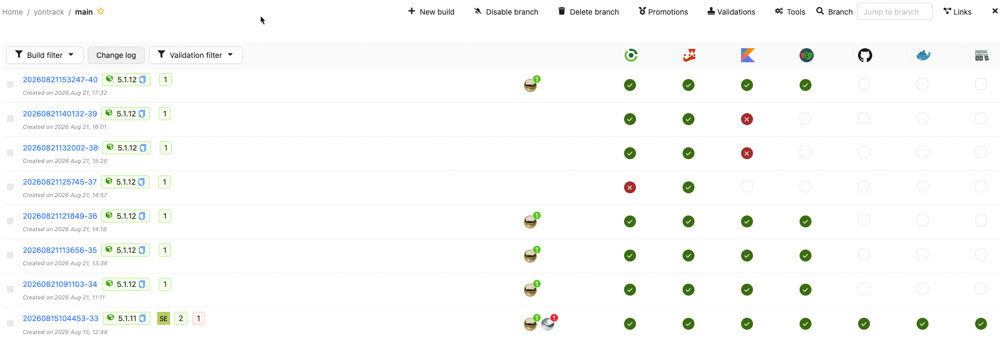
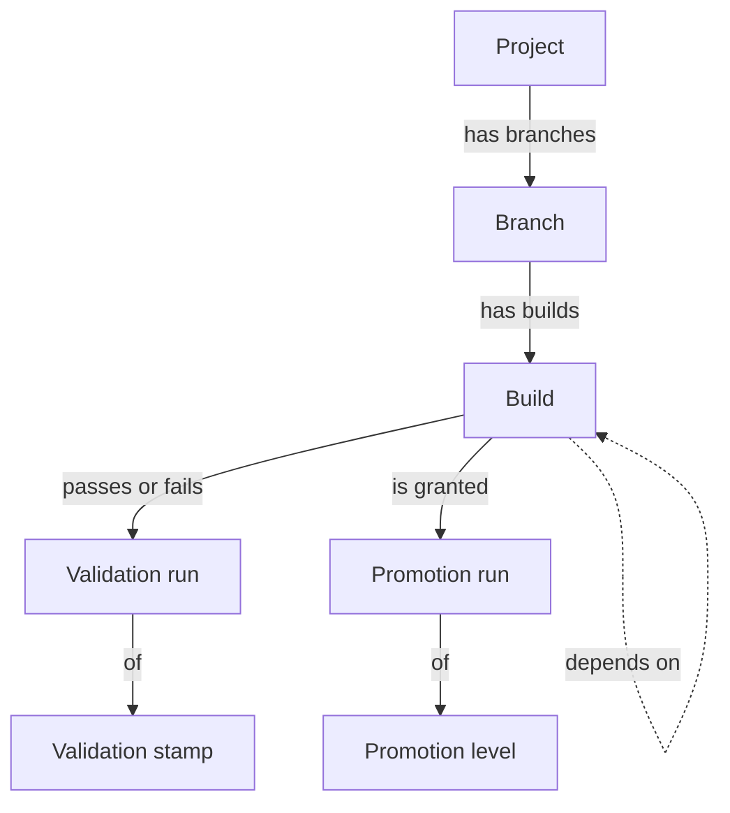
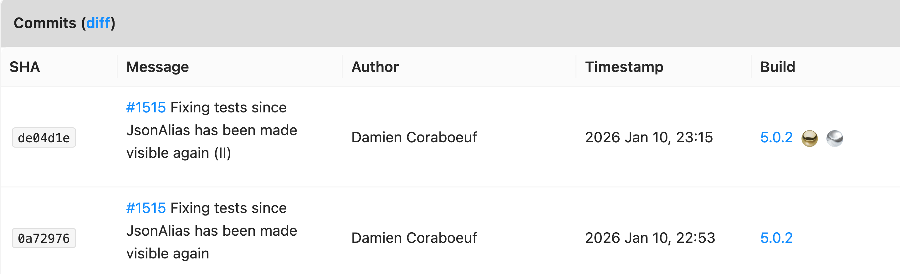
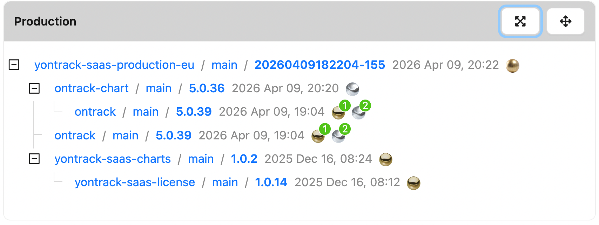

<div align="center">

<picture>
  <source media="(prefers-color-scheme: dark)" srcset="doc/readme/yontrack-text-dark.svg">
  
</picture>

### Track. Trust. Deliver.

[](https://github.com/yontrack/yontrack/releases)
[](LICENSE)
[](https://docs.yontrack.com)
[](https://ontrack-run.slack.com/)

[Documentation](https://docs.yontrack.com) ·
[Quick start](#quick-start) ·
[Website](https://yontrack.com) ·
[Contributing](CONTRIBUTING.md)

</div>

---

Yontrack is a CI/CD orchestration platform. It records every build, validation and promotion across
your delivery pipelines — then turns that record into changelogs, automated version updates,
notifications and dashboards.

Point your pipelines at it with a single `.yontrack/ci.yaml` file, and Yontrack builds the picture
from there.



## How it works

Yontrack organises everything it collects around a small model.



* a **build** is one run of your pipeline on a **branch** of a **project**, tied to a commit
* a **validation stamp** is a quality probe — tests, a scan, a deployment check. Each time a build
  goes through one, it records a **validation run** with a status
* a **promotion level** says something broader about a build: it's good enough to be released, to be
  deployed, to be depended upon. Granting one produces a **promotion run**
* builds **link to other builds**, across branches and projects, which is what lets Yontrack answer
  "what is actually in this release?"

Promotions are the pivot: once a build is promoted, Yontrack can trigger everything else —
changelogs, version bumps in downstream repositories, notifications, workflows.

## Quick start

Install with the [Helm chart](https://github.com/nemerosa/ontrack-chart):

```bash
helm install yontrack oci://registry-1.docker.io/nemerosa/charts/yontrack
```

This brings up Yontrack, PostgreSQL, Elasticsearch, RabbitMQ, and a Keycloak instance for
authentication (default login `admin` / `admin`). Point it at your own
[OIDC](https://docs.yontrack.com/yontrack/ref/latest/content/security/oidc.html) or
[LDAP](https://docs.yontrack.com/yontrack/ref/latest/content/security/ldap.html) provider when
you're past the first look.

See the [getting started guide](https://docs.yontrack.com/yontrack/ref/latest/content/start/getting-started.html)
for the full setup.

## Get your CI into Yontrack

Declare what your pipeline produces in a `.yontrack/ci.yaml` file at the root of your repository:

```yaml
version: v1
configuration: { }
```

Then, in your GitHub Actions workflow, configure the Yontrack CLI once — it registers the project,
branch and build:

```yaml
- name: Yontrack configuration
  uses: nemerosa/ontrack-github-actions-cli-config@v2
  env:
    YONTRACK_URL: ${{ vars.YONTRACK_URL }}
    YONTRACK_TOKEN: ${{ secrets.YONTRACK_TOKEN }}
  with:
    github-token: ${{ secrets.GITHUB_TOKEN }}
```

…and report validations from any later step:

```yaml
- name: Tests
  id: tests
  run: ./gradlew test

- name: Validation
  if: ${{ steps.tests.outcome != '' }}
  run: |
    yontrack validate \
      --validation TESTS \
      --status ${{ steps.tests.outcome == 'success' && 'PASSED' || 'FAILED' }}
```

That's the whole loop. From there, `ci.yaml` is where you declare which validations gate which
promotions:

<details>
<summary>A fuller <code>.yontrack/ci.yaml</code> — validations, promotions, notifications</summary>

```yaml
version: v1
configuration:
  defaults:
    branch:
      validations:
        BUILD:
          tests: { }
        UI_UNIT:
          tests: { }
        ACCEPTANCE:
          tests: { }
        DOCUMENTATION: { }
      promotions:
        BRONZE:
          validations:
            - BUILD
            - UI_UNIT
            - ACCEPTANCE
        RELEASE:
          promotions:
            - BRONZE
          validations:
            - GITHUB.RELEASE
            - DOCUMENTATION
      notificationsConfig:
        notifications:
          - name: On validation error
            events:
              - new_validation_run
            keywords: failed
            channel: slack
            channelConfig:
              channel: '#notifications'
              type: 'ERROR'
            contentTemplate: |
              Build ${build} has failed on ${validationStamp}.
```

`BRONZE` is granted automatically once `BUILD`, `UI_UNIT` and `ACCEPTANCE` all pass; `RELEASE`
builds on `BRONZE`. This is Yontrack's own configuration, trimmed — the file this repository ships
in [`.yontrack/ci.yaml`](.yontrack/ci.yaml) is the real thing.

</details>

The same file works from [Jenkins pipelines](https://docs.yontrack.com/yontrack/ref/latest/content/start/feeding/jenkins.html),
the [CLI](https://github.com/nemerosa/ontrack-cli) or direct
[GraphQL](https://docs.yontrack.com/yontrack/ref/latest/content/api/graphql.html) calls.

## What you get from it

### Changelogs that write themselves

Between any two builds, across branches, or since the last promotion — Yontrack computes the
commits and issues that went in, follows the links down into your dependencies, and renders the
result as text, Markdown, HTML or a notification.



[Changelogs →](https://docs.yontrack.com/yontrack/ref/latest/content/integrations/changelogs/changelogs.html)

### Auto-versioning on promotion

When a module is promoted, Yontrack opens a pull request in every repository that depends on it,
bumping the version, running any post-processing you configured, and merging it once the target's
own checks pass. Versions propagate only when the quality gates on both sides are open.

[Auto-versioning →](https://docs.yontrack.com/yontrack/ref/latest/content/integrations/auto-versioning/auto-versioning.html)

### Notifications and workflows

Subscribe to any event — a promotion, a failed validation, a new branch — on any entity or globally,
and route it to Slack, email, a webhook, a GitHub workflow, Jira and more. Chain several actions
together as a DAG when one notification isn't enough.

[Notifications →](https://docs.yontrack.com/yontrack/ref/latest/content/integrations/notifications/index.html) ·
[Workflows →](https://docs.yontrack.com/yontrack/ref/latest/content/integrations/workflows/workflows.html)

### Dashboards and the delivery chain

Build your own dashboards from widgets: branch statuses, promotion and validation charts,
end-to-end lead time, and dependency trees that show what a given release is actually made of.



[Dashboards →](https://docs.yontrack.com/yontrack/ref/latest/content/dashboards/index.html)

### Integrations

GitHub, GitLab, Bitbucket (Cloud & Server), Jenkins, Jira, Artifactory, SonarQube, Slack, Vault,
Terraform Cloud, InfluxDB, Elasticsearch — plus a GraphQL API and an open-source CLI for everything
else.

## Working with AI agents

Yontrack ships agent skills as a Claude Code plugin — wiring a repository up to Yontrack from GitHub
Actions, or setting up auto-versioning between two repositories, without reading the docs first:

```
/plugin marketplace add yontrack/yontrack-skills
/plugin install yontrack-skills@yontrack
```

See [yontrack/yontrack-skills](https://github.com/yontrack/yontrack-skills).

## Feeding Yontrack

* [REST & GraphQL API](https://docs.yontrack.com/yontrack/ref/latest/content/api/graphql.html)
* [CLI](https://github.com/nemerosa/ontrack-cli)
* [Jenkins pipeline library](https://github.com/nemerosa/ontrack-jenkins-cli-pipeline/)
* [GitHub action](https://github.com/nemerosa/ontrack-github-actions-cli-config)

## Documentation

Full documentation lives at [docs.yontrack.com](https://docs.yontrack.com).

## Contributing

[Contributions](CONTRIBUTING.md) are welcome — see [DEVELOPMENT.md](DEVELOPMENT.md) to get a local
environment running.

## Commercial support

Yontrack is developed by [Nemerosa](https://yontrack.com), which also offers consultancy, training
and support around it — see [yontrack.com/services](https://yontrack.com/services).

## License

[MIT](LICENSE)
