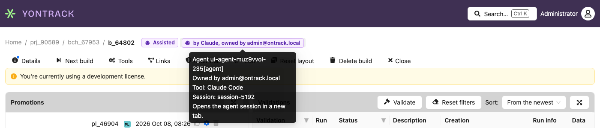
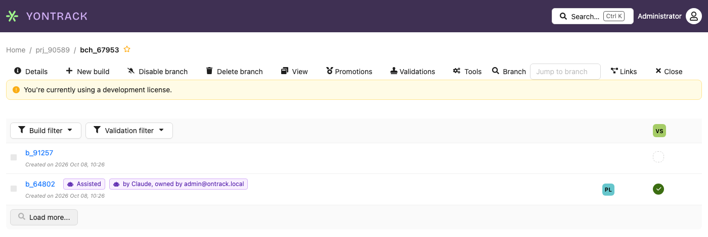
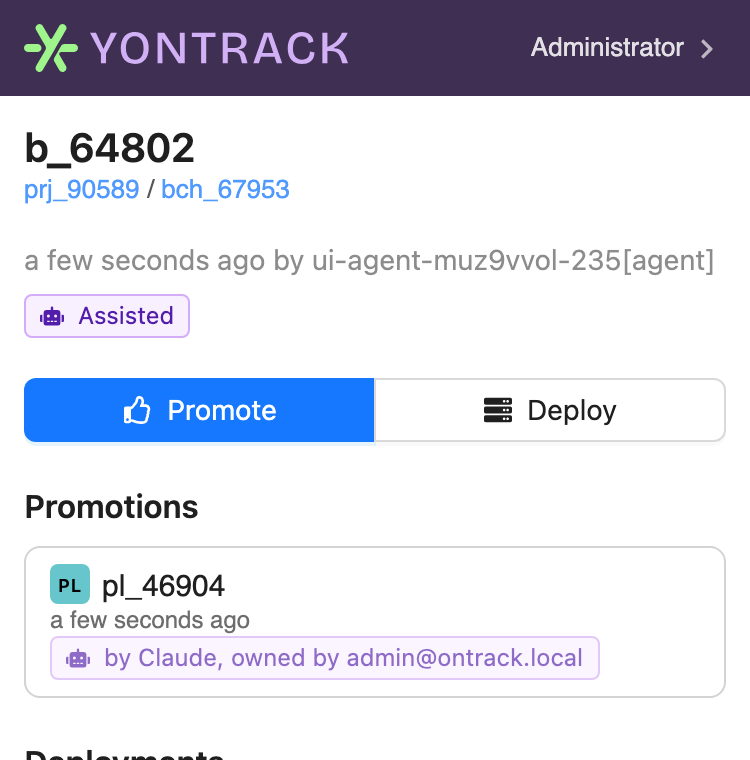
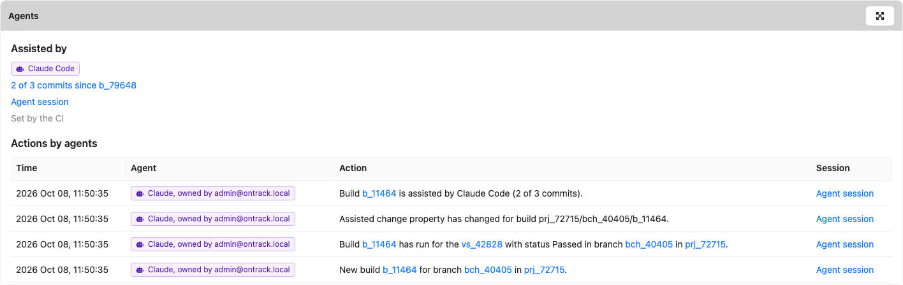

# Agents

AI coding agents — Claude Code, Codex, Copilot, Devin and the like — increasingly act on the
delivery record: they create builds, record validations and read what is deployed. Yontrack gives
such an agent an identity of its own, a **registered agent**, so that the record can tell an agent
from a person and name the person who answers for it.

## What an agent is

An agent is an account of kind *agent*:

* it is identified as `<slug>[agent]`, for example `claude-code-ci[agent]`. The slug has 1 to 32
  lowercase letters, digits or dashes, and never changes;
* it has a display name, the **tool** behind it (Claude Code, Codex, Copilot, Devin, Other, or
  any other name), and an optional description;
* it has exactly one **owner**, the person accountable for it;
* it acts on Yontrack with its own [API tokens](../security/tokens.md), and with nothing else.

An agent **never logs in through the identity provider**. `[` is not valid in an email address, so
no identity provider can issue a login for an agent identifier, and Yontrack refuses any token of
the identity provider whose email is one.

Agents are **never mail recipients**: the mail notifications skip any agent identifier among their
recipients.

An agent has **no rights of its own**: see [What an agent may do](#what-an-agent-may-do).

## The owner

Every agent has an owner, a person — never another agent.

* Any user registers and manages **their own** agents.
* An administrator manages **every** agent, can register one for another owner, and is the only
  one who can **transfer** an agent to another owner.
* Deleting a person deletes **their agents** and the agents' tokens. The confirmation of the
  deletion names them.

Whatever an agent did stays signed with its name, even once the agent is deleted.

## Registering an agent

In the user menu, go to _User information_ > _My agents_ and click on _Register an agent_:

* **Slug** — identifies the agent as `<slug>[agent]`, for good;
* **Display name** — how the agent is shown;
* **Tool** — pick one of the known tools, or type another name;
* **Description** — optional.

Administrators get an additional **Owner** field, and find every agent of the instance in
_System_ > _Agents_, with its tool, its owner, its number of tokens and the last time one of them
was used. In _System_ > _Account management_, agents are hidden by default: the _Show agents_
switch lists them, with their kind.

Through the API, the `registerAgent` mutation does the same, and the `agents` query lists the agents
visible to the caller: all of them for an administrator, their own for anybody else.

```graphql
mutation {
  registerAgent(input: {
    slug: "claude-code-ci",
    displayName: "Claude Code in CI",
    tool: "Claude Code",
  }) {
    agent { id email }
    errors { message }
  }
}
```

## Tokens

The page of an agent lists its tokens and generates new ones. The owner and the administrators
can generate them:

* an agent has as many **named tokens** as needed — one per machine or per pipeline, say;
* a token follows the usual validity rules of the instance;
* the value of a token is **shown only once**, when it is generated: copy it then;
* a token, or all the tokens of an agent, can be revoked at any time.

The agent then uses its token like any other API token, in the `X-Ontrack-Token` header. A call made
with it is authenticated as the agent:

```graphql
{
  user {
    account { email kind owner { email } }
  }
}
```

The `generateAgentToken`, `revokeAgentToken` and `revokeAllAgentTokens` mutations do the same
through the API.

## The agent on the record

Whatever an agent does is signed with its identifier, `<slug>[agent]`, as the user of the
signature — never with its owner's name. The signature also carries the **actor**: the agent, its
display name and tool, its owner, and the agent session behind the action. They are copied when the
agent acts, so the record keeps them when the agent is renamed, transferred or deleted.

The actor is recorded on builds, validation run statuses, promotion runs, events, the changes
of the deployment pipelines, and the data and the overrides of their admission rules. A person's
signature has no actor.

Through the API, the `creation` field of a build, a promotion run or a validation run gives it:

```graphql
{
  build(id: 123) {
    creation {
      user
      time
      actor { kind agent displayName tool owner sessionId sessionLink }
    }
  }
}
```

`actor` is `null` for a person.

When an agent's call leads Yontrack to act by itself, for example when it processes a payload
received from the agent in the background, what it does is still signed with the agent as the
actor.

A caller supplying its own signature — the GitHub ingestion naming the user of a workflow run, or
a backdated build — chooses the user and the time of the signature, never its actor: the actor is
always the authenticated one. A caller can neither claim to be an agent nor hide that it is one.

## Identifying a session

An agent acts within a session: a conversation, a task or a run of the tool behind it. The agent
names it with two HTTP headers sent alongside its token:

| Header | Value |
|---|---|
| `X-Yontrack-Agent-Session` | The opaque identifier of the session, at most 255 characters |
| `X-Yontrack-Agent-Session-Link` | An absolute `https` link to the session, at most 1000 characters |

```bash
curl https://yontrack.example.com/graphql \
  -H "X-Ontrack-Token: $AGENT_TOKEN" \
  -H "X-Yontrack-Agent-Session: 01JC9V6Z3N" \
  -H "X-Yontrack-Agent-Session-Link: https://claude.ai/code/01JC9V6Z3N" \
  -H "Content-Type: application/json" \
  -d '{"query": "{ user { account { email } } }"}'
```

Yontrack stores the session and renders its link; it never fetches nor interprets it.

* The headers are read for an **agent token** only. With any other token, or without a token,
  they are ignored.
* Both values are trimmed. A blank session, or one longer than 255 characters, is ignored.
* A link which is not an absolute `https` URL, or which is longer than 1000 characters, is dropped
  with a warning in the logs, and the session is kept without it. A link without a session is
  ignored.
* None of these ever fails the call.

## Telling an agent from a person

Wherever the UI says who did something, an agent is shown with a badge: a robot icon and "by
*display name*, owned by *owner*". Its tooltip gives the identifier of the agent, its owner, its
tool and its session; when the agent gave a [link to its session](#identifying-a-session), the
badge opens it in a new tab. A person is shown as before, by their name, with nothing added.



A build also says whether its commits were [written with assistants](#assisted-builds):

* **Assisted** — its tooltip gives the number of assisted commits, the assistants and the links to
  their sessions;
* **Assisted: unknown** — a neutral badge, whose tooltip says why it could not be computed;
* nothing when the build is not assisted, or before it has been computed.

The badges show on:

| Where | Badges |
|---|---|
| The build page, and the rows of the builds on the branch page | Assisted, and the agent which created the build |
| The validation run page and its statuses, the validations of a build | The agent behind each status |
| The promotions of a build, the promotion run page, the history of a promotion level | The agent which promoted |
| The deployment page: its timeline, the overrides and the answers to its admission rules | The agent behind each change |
| *Accounts* and *Agents* in the administration | The kind of the account, *Agent* or *Person* |
| *Information › Events* | The agent behind each event |



On a phone, the build screen shows the *Assisted* badge in its header, and the agent which made
each of its promotions:



The badges say what they mean in words: their colour and their icon are never the only cue, and a
screen reader reads "by agent Claude, owned by alice@example.com" or "Assisted: 3 of 12 commits,
by Claude Code".

## Following what agents do

The actor of an event can be selected on:

* the [keywords of a subscription](../integrations/notifications/index.md#keywords) —
  `actor:agent`, `actor:human` and `agent:<slug>` — so that "notify me when an agent promotes" or
  "a person marked a deployment as done" are ordinary subscriptions, and the workflows they trigger
  are filtered the same way;
* the *Actor* filter of the [events page](../operations/events.md#filtering-the-events) — persons,
  agents, or one agent — which its export follows, with the actor of each event in its columns.

The [Agents section of a build](#what-agents-did-on-a-build) lists what agents did on that build.

## What agents did on a build

The build page has an **Agents** section, read before promoting a build: what agents had to do with
it. It shows only when there is something to show — the commits of the build were assisted, or an
agent acted on it — and anyone who can see the build sees it.



It holds two lists, which are never merged nor linked: an assistant named by a commit is a kind of
tool, never a registered agent.

**Assisted by**, from git — the [assisted change](#assisted-builds) of the build:

* the assistants of its commits;
* "*N* of *M* commits since *previous build*", linking to the change log between the two builds;
* the links to the agent sessions behind the commits;
* how this was obtained: computed by Yontrack from the change log, set by the CI, or unknown — with
  the reason.

**Actions by agents**, from the event log — the events of the build whose actor is an agent, newest
first: its creation, its validations, its promotions, its links, its properties... Each one gives
its time, its message, the [badge](#telling-an-agent-from-a-person) of the agent and a link to its
[session](#identifying-a-session). _Load more_ reads the older ones. An event which also concerns a
project you cannot see — a link from a build of that project, for example — is left out.

The events are the source of these actions: there is no other record of them. With the
[retention of the events](../operations/events.md#retention) set, the actions older than the
retention period disappear from the section with the events. The *Assisted by* part is a property
of the build, and stays.

Through the API, `agentActions` gives the same page of events on a build, and the assisted change
gives the build it was computed from:

```graphql
{
  build(id: 123) {
    assistedChange {
      assistants
      assistedCommits
      totalCommits
      previousBuild { id name }
    }
    agentActions(offset: 0, size: 20) {
      pageInfo { nextPage { offset size } }
      pageItems {
        time
        message
        eventType { id }
        actor { agent displayName owner sessionLink }
      }
    }
  }
}
```

A page holds at most 100 events. There is no total count: `pageInfo.nextPage` tells whether there
are more.

The mobile UI shows the badges only, not this section.

## What an agent may do

An agent's rights are **its owner's rights, narrowed by the agent policy**. Nothing is assigned to
the agent itself — a role granted to an agent is ignored — so demoting or deleting the owner bounds
the agent at once, with nothing to keep in sync. The owner's rights are all of them: roles, groups,
groups mapped from the identity provider, and project permissions.

| Action | Default |
|---|---|
| Read everything its owner can | yes |
| Create builds, validation runs, build links and build properties (record evidence) | yes, unless the validation stamp takes [evidence from non-agents only](../concepts/model/index.md#evidence-from-non-agents-only) |
| Promote | no, unless the promotion level [admits agents](../concepts/model/index.md#agents-admitted) |
| Start or finish a deployment | no, unless the slot [admits agents](../integrations/environments/environments.md#agents-admitted) |
| Satisfy a manual admission rule | **never** |
| Change configuration (projects, branches, promotion levels, validation stamps, slots, subscriptions, CasC, settings, accounts) | no |
| Delete builds or promotions, override admission rules, cancel deployments | no |

Evidence is cheap to record and safe to audit; gates are where accountability lives.

The policy is an **allowlist**: every function which is not listed in it is denied to agents,
including the functions which extensions add later.

| Function | Granted when |
|---|---|
| `ProjectList`, `ProjectView`, `EnvironmentList`, `SlotView`, `ProjectFindingsView`, `ProjectSubscriptionsRead`, SCM catalog access | the owner holds it |
| `BuildCreate`, `BuildConfig` | the owner holds it |
| `ValidationRunCreate`, `ValidationRunStatusChange`, `ValidationRunStatusCommentEditOwn` | the owner holds it |
| `PromotionRunCreate` | the owner holds it, on a promotion level which admits agents |
| `SlotPipelineCreate`, `SlotPipelineStart`, `SlotPipelineFinish`, `SlotPipelineData`, `SlotPipelineWorkflowRun` | the owner holds it, in a slot which admits agents |

Never granted, whatever the owner may do: `SlotPipelineOverride`, `SlotPipelineCancel`,
`SlotPipelineDelete`, the creation, edition and deletion of projects, branches, promotion levels,
validation stamps and slots, `ProjectConfig`, the subscriptions, the CasC, `AccountManagement`,
`ApplicationManagement`, `EventsAudit`, `BuildEdit`, `BuildDelete` and `PromotionRunDelete`.

A refusal by the agent policy always says why, in the GraphQL error or in the body of the HTTP 403:

```
agent claude-code-ci[agent] may not ProjectEdit (agent policy)
```

### Agent asks, human approves

An agent never approves a deployment: in a slot which admits agents, it starts the pipeline, and
its approval of a [manual admission rule](../integrations/environments/environments.md#agents-admitted)
is refused with "an agent cannot approve; ask _owner_" — even when the rule lists the agent. The
pipeline stays a candidate until a person approves it. Promotions stay a person's decision, unless
the promotion level admits agents.

### Auto-promotion

[Auto-promotion](../concepts/model/auto-promotion.md) is not concerned by the agent policy. When an
agent records the validations which complete the requirements of a promotion level, Yontrack itself
grants the promotion on the agent's behalf, whether the level admits agents or not: the
auto-promotion rules of the level are the gate.

## Reading your own policy

An agent should know which gates it may pass **before** acting, rather than by being refused and
retrying. It reads its own policy on a project through the `user` query, authenticated with its
token:

```graphql
query AgentPolicy($project: String!, $branch: String) {
  user {
    account { kind owner { fullName email } }
    agentPolicy(project: $project) {
      owner
      canRecordEvidence
      promotionLevels(branch: $branch) { id branch name }
      slots { id environment qualifier manualApproval }
    }
  }
}
```

* `account.kind` is `AGENT`, and `account.owner` names the person accountable for the agent;
* `agentPolicy` is `null` for a person. For an agent, it gives:
    * `owner` — the full name of the owner, the person to ask when the policy stops the agent;
    * `canRecordEvidence` — whether the agent may create builds and validation runs on the project;
    * `promotionLevels` — the promotion levels of the **enabled** branches of the project which
      [admit agents](../concepts/model/index.md#agents-admitted), provided the owner may promote on
      the project: empty otherwise. The optional `branch` argument restricts them to one branch;
    * `slots` — the slots of the project which
      [admit agents](../integrations/environments/environments.md#agents-admitted), provided the
      owner may start a deployment pipeline in them. `manualApproval` is `true` when a manual
      admission rule will still stop the agent: it may start the pipeline, but a person approves it.

An unknown project, or one the owner cannot see, is an error. This is the query the Yontrack conduct
skill for agents runs before it acts on a project.

The [readiness](../concepts/model/index.md#readiness) of a build tells the agent the same thing for
one target: when the agent reads it for a promotion level or a slot which does not admit agents, an
`AGENT_POLICY` item says so — "agents are not admitted on _GOLD_; ask _owner_" — alongside everything
else which is missing, so that one call tells the agent all that stands in its way.

## A CI pipeline is not an agent

A CI pipeline acting through an account holding the `AUTOMATION` role is **automation**, not an
agent: it runs a script that a person wrote and reviewed, and its account stays as it is. Nothing
converts it into an agent.

An agent is a non-human principal that decides what to do by itself — typically an AI coding
agent working on a person's behalf. Register one when the record must be able to say "this was
done by an agent, owned by this person".

## Assisted builds

A build is **assisted** when the commits of its change — since the previous build of its branch —
were written with coding agents. The kinds of agents are the
[assistants](../integrations/changelogs/changelogs.md#agent-markers) of the commits, recognised from
their trailers (`Co-Authored-By`, `Assisted-by`, `Claude-Session`), their authors and the
[Agent markers](../integrations/changelogs/changelogs.md#agent-markers) settings. They are not the
registered agents above: *assisted by* comes from git, *actions by* from the record.

The fact is a **property** of the build, _Assisted change_, rather than a validation: being assisted
is neither a success nor a failure.

| Field             | Meaning                                                                       |
|-------------------|-------------------------------------------------------------------------------|
| `basis`           | How the value was obtained: `COMPUTED`, `SET_BY_CI` or `UNKNOWN`              |
| `unknownReason`   | Why the value is unknown, when the basis is `UNKNOWN`                         |
| `assistants`      | Names of the assistants, distinct and sorted. The build is assisted when there is at least one |
| `assistedCommits` | Number of commits written with an assistant                                   |
| `totalCommits`    | Number of commits in the change of the build                                  |
| `sessionLinks`    | Links to the agent sessions behind the commits, at most 20                    |
| `previousBuildId` | ID of the build the change log was computed from                              |

### How Yontrack computes it

When a build is created, and when its commit is set — which usually happens just after — Yontrack
computes the change log from the previous build of the branch which has a commit, and counts the
assistants of its commits. This runs **in the background**, after the build is saved: creating a
build never waits on the SCM.

* A value **set by the CI** is never recomputed.
* A build without a commit gets nothing yet: the computation runs again when the commit is set.
* The value is `UNKNOWN` when the computation cannot run, with its reason:
    * `no SCM` — the project has no SCM able to compute change logs;
    * `no previous build with a commit` — typically, the first build of a branch;
    * `SCM error: …` — the SCM failed. It is computed again the next time the commit of the build is
      set.
* Computing the value again gives the same value, and changes nothing.

A build without the property has not been computed yet: like `UNKNOWN`, it is neither assisted nor
not assisted.

### Setting it from the CI

When Yontrack has no SCM for the project, the CI sets the property itself, with the `SET_BY_CI`
basis — which is the default of the mutation:

```graphql
mutation {
  setBuildAssistedChangeProperty(input: {
    project: "my-project",
    branch: "main",
    build: "42",
    assistants: ["Claude Code"],
    assistedCommits: 3,
    totalCommits: 5,
    sessionLinks: ["https://claude.ai/code/session_0123"],
  }) {
    errors { message }
  }
}
```

The generic property mutations (`setBuildPropertyById` with the
`net.nemerosa.ontrack.extension.scm.changelog.assistants.AssistedChangePropertyType` type) accept the
same fields as JSON.

The number of assisted commits cannot exceed the total number of commits, and an `UNKNOWN` value
cannot have assistants.

The value is available in GraphQL as `Build.assistedChange`, `null` when it has been neither computed
nor set:

```graphql
{
  build(id: 42) {
    assistedChange {
      assisted
      basis
      unknownReason
      assistants
      assistedCommits
      totalCommits
      sessionLinks
    }
  }
}
```

### The `build_assisted` event

The first time the property of a build is written with at least one assistant, whether Yontrack
computed it or the CI set it, the `build_assisted` event is posted:

> Build 42 is assisted by Claude Code, Codex (2 of 5 commits).

Its values are `assistants`, `assistedCommits`, `totalCommits` and `sessionLinks`, the lists being
separated by a comma and a space. It is posted **once** for a build: there is no clearing event, and
a later value which disagrees posts nothing — a recomputation that disagrees is a configuration
problem, not a change of the build. Like any event, notifications can subscribe to it.

### Requiring validations of assisted builds

A promotion level can require validations of assisted builds only — a human review, a security
scan — with its [Assisted builds require](../concepts/model/index.md#assisted-builds-require)
property. It **fails closed**: a build whose assisted change is not computed yet, or is `UNKNOWN`,
counts as assisted. This ruling is under license, as the *Agent governance* feature
(`extension.agents`) — see [Licensing](../appendix/licensing.md).

### Templating

The builds expose their assisted change to [templates](../appendix/templating.md):

* `${build.assisted}` — `true`, `false`, or `unknown` when the value has not been computed or could
  not be;
* `${build.assistants}` — the names of the assistants, separated by a comma and a space; empty when
  there is none.
