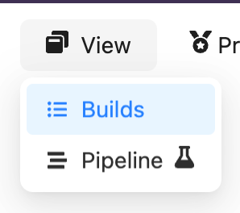
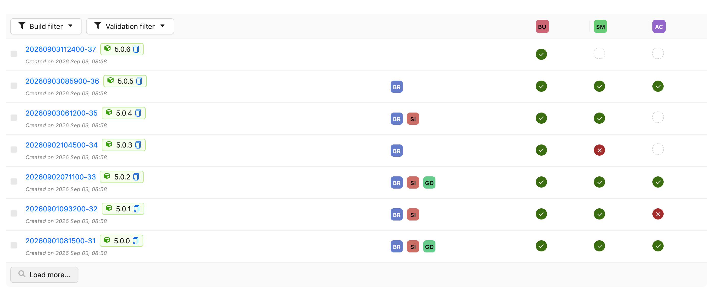
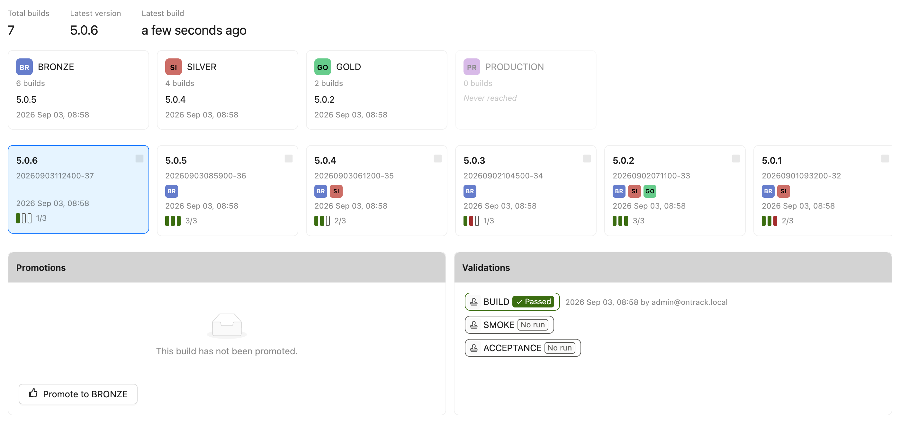
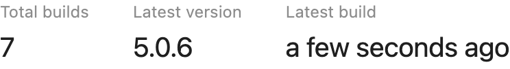
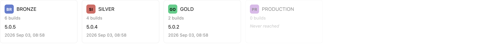
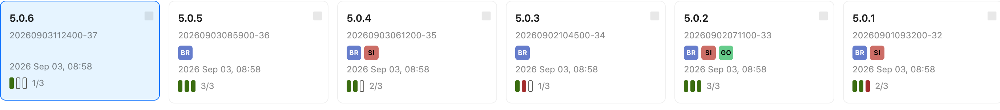
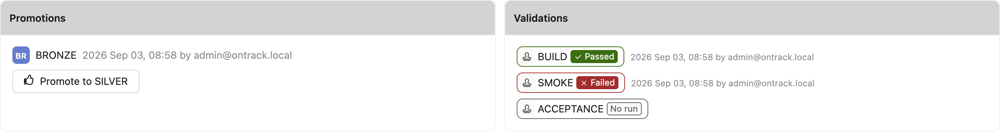

# Branch views

A branch holds the same information whatever you came to it for, but not every question is best
answered by the same layout. Yontrack therefore offers several *content views* for a branch - two
interchangeable readings of the branch, sharing the same page, the same filters and the same
permissions, and differing only in how they arrange what they show.

| View                      | Reads the branch as                                              |
|---------------------------|------------------------------------------------------------------|
| [Builds](#the-builds-view)     | a list of builds, most recent first                         |
| [Pipeline](#the-pipeline-view) | a promotion pipeline - what is release-ready right now      |

The two are peers: one is never reached from inside the other, and neither is a sub-mode of the
other. **Builds** is the default, and remains so for existing users.

## Switching between views

The view is chosen from the **View** menu in the branch command bar.

Three things follow from picking a view:

* the choice is **remembered**, so the next branch you open uses the same view;
* the choice is **linkable** - the address gains a `?view=` parameter, and a link carrying it opens
  on that view whatever the recipient's own preference is;
* an unknown or stale `?view=` value falls back to the Builds view rather than failing.

The [build filter](../build-filtering/index.md) and the validation stamp filter sit *above* the
view, not inside it. A filter you set in one view is still in force when you switch to the other.

## The Builds view

The Builds view is the historical reading of a branch: one row per build, most recent first, with
the promotions reached by each build and a column per validation stamp.

It is the view to use when the build list itself is the subject - looking for a particular build,
comparing validation results across many builds, or selecting two builds for a
[change log](../../integrations/changelogs/changelogs.md).

## The Pipeline view

!!! warning "Experimental"

    The Pipeline view is experimental and still being refined. It is marked as such in the product,
    with a flask icon next to its entry in the View menu and a dismissible banner on the view
    itself. Feedback is welcome in
    [GitHub Discussions](https://github.com/yontrack/yontrack/discussions).

    

The Pipeline view answers a different question: not *what has been built lately*, but *what is
release-ready right now, and what does a release still have to go through*.

It has four regions, in the order they answer that question.

### Branch facts

The total number of builds on the branch, the latest version, and when the branch was last built.

These are facts about the **branch**, outside any filter - the total does not move when you narrow
the build filter, because a number that changes with the filter is a readout of the filter rather
than a fact about the branch.

The *latest version* is the [display name](../build-filtering/index.md#filtering-on-the-build-display-name)
of the most recent build - its release label when it has one. It is deliberately not "the most
recent build carrying a release": that is a different, more expensive question whose answer goes
stale as soon as an unlabelled build lands. On a project which does not use release labels, the
figure is omitted rather than repeating the build name shown just below.

### The promotion band

One card per [promotion level](../model/index.md) of the branch, in promotion order: how many builds
have reached it, and which build reached it last.

A level nobody has ever reached is still shown, dimmed and marked *Never reached* - the band
describes what a release has to go through, not only what has already happened. Clicking the build
named on a card selects it in the inspector below, loading further pages of builds if that build is
older than the ones currently shown.

The band is hidden entirely on a branch with no promotion levels, and on a branch with no builds:
a full row of never-reached stages above an empty timeline states the obvious loudly.

### The build timeline

The builds of the branch, most recent first, as cards rather than rows: version, build name,
promotions reached, and how many of the validations selected by the validation filter have passed.

The timeline obeys the same [build filter](../build-filtering/index.md) as the Builds view, and
loads further builds on demand. Clicking a card selects that build.

Builds can also be selected in **pairs** here, with the same checkboxes as in the Builds view, to
produce a [change log](../../integrations/changelogs/changelogs.md) between them.

### The build inspector

Everything that is true of the one build currently selected: its promotions, with the button to
promote it further, and its validations with their status.

The selected build is part of the address, as a `?build=` parameter, so a build worth showing
someone can be linked to directly. Opening such a link selects the build it names even when that
build is old enough not to be in the first page of the timeline.

When no build is named, the most recent one is selected.

## Not to be confused with

The word *pipeline* is used for two unrelated things in Yontrack:

* the **Pipeline view** described here, which is a way of reading a branch, and changes nothing;
* the **deployment pipeline** of the [environments](../../integrations/environments/environments.md)
  feature, which is a real object with a lifecycle - created, deploying, deployed - representing one
  attempt to deploy a build into an environment slot.
