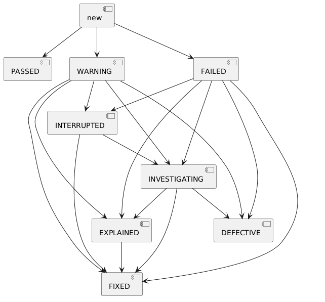
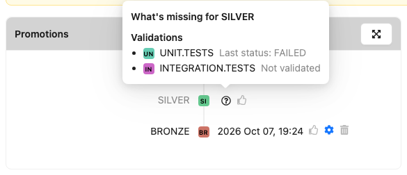

# Yontrack model


At the core, Yontrack collects information using an information model composed of the following entities:

* [projects](#projects)
* [branches](#branches)
* [branches](#builds)

Branches are configured with a list of [validation stamps](#validation-stamps)
and [promotions levels](#promotion-levels)
that builds can be associated with [validation runs](#validation-runs) and [promotions](#promotions).

Finally, each entity in Yontrack can be associated with [properties](#properties), which enrich the model with
additional information.

## Projects

Projects are at the root of the model hierarchy of Yontrack. They can be linked to each other (typically
by [links between builds](build-links.md)).

In most cases, a project is linked to a SCM repository. But there are situations where creating a project independently
of a repository is useful.

Projects can be tagged with [labels](project-labels.md), to organise them across the hierarchy and to filter the
project lists.

## Branches

One project can have several branches. They are usually linked to an actual SCM branch.

## Builds

One build represents ... one build in a given branch. These builds are typically linked to an actual build
(or workflow run, or pipeline execution, etc.) in a CI system. Depending on your setup, relaunching a build
in your CI can lead to a unique or several builds in Yontrack.

A build would be associated with a commit in the SCM repository.

[Links between builds](build-links.md) are used to define the dependency between builds, across branches, across
projects.

## Validation stamps

When a build is being built by the CI engine, it is tested, scanned, probed, deployed, etc. This can happen in the
same pipeline (or workflow run, etc.) or in several pipelines, which can be run asynchronously, nightly, etc.

These pipelines represent different quality probes on a given build. We call them _validation stamps_ in Yontrack,
because they are like actual stamps we would put on a given package, the [build](#builds).

The validation stamps can be typed but not necessarily. For example, we can wish to represent a validation as a test
summary, with the number of failed tests, skipped tests, passed tests, etc.

## Promotion levels

While validation stamps are linked to a specific kind of check, test, scan result, etc., _promotion levels_ are used to talk more generally about the quality of a given build.

They can typically group several validation stamps together, rely on other promotion levels. They can also be granted independently.

Promotion level names can be anything, but you have to agree at your organization level on their meanings. They will often be used to talk about quality throughout all your projects. Something often used is to use abstract names, like medal names, like gold, silver, bronze, etc. But again, this is up to you.

Promotion levels can have [configurable fields](promotion-level-fields.md) that users must fill in when promoting a build.

### Agents admitted

A registered [agent](../../agents/index.md) may promote a build only to a promotion level which
**admits agents**, and only if its owner may promote. Without it, the promotion is refused with a
message saying so:

```
agent claude-code-ci[agent] may not promote to GOLD: the promotion level does not admit agents (agent policy)
```

A promotion level admits agents when it has the *Agents admitted* property. Set it:

* on the promotion level page, through its properties;
* in the [CI configuration](../../configuration/ci-config.md#agents), with `agents: true` on the
  promotion;
* through the API, with the `setPromotionLevelAgentsAdmittedProperty(ById)` mutation, or as code
  with the `net.nemerosa.ontrack.extension.general.AgentsAdmittedPropertyType` property.

[Auto-promotion](auto-promotion.md) is **not** concerned: when an agent records the validations
which promote a build automatically, the promotion is granted by Yontrack itself, on behalf of the
agent, and the auto-promotion rules of the level are the gate.

### Assisted builds require

!!! note

    This condition is under license, as the feature `extension.agents` ("Agent governance"). See
    [Licensing](../../appendix/licensing.md).

A promotion level can require more of an [assisted build](../../agents/index.md#assisted-builds) —
one whose commits were written with coding agents — than of the others: with the *Assisted builds
require* property, it lists validation stamps of its branch which an assisted build must **pass**
before being promoted to the level. Typically, a human review or a security scan.

When the build is assisted, and one of the listed stamps has not passed — its last run is not
`PASSED` nor `FIXED`, or it has no run — the promotion is refused, naming the first such stamp:

```
Assisted build: REVIEW must pass first.
```

The rule **fails closed**: a build whose assisted change is not computed yet, or is `UNKNOWN` — no
SCM, no previous build, an SCM error — counts as **assisted**. A race with the computation, which
runs in the background after the build is created, or a missing SCM, never bypasses the review. A
listed stamp which does not exist on the branch cannot pass either. A build known **not** to be
assisted is not concerned.

The condition applies to every promotion: by a person, by the API, by an agent,
by [auto-promotion](auto-promotion.md) — which waits until the stamps have passed — and by
workflows. The [readiness](#readiness) of the build lists every
missing stamp, as a `CHECK` named *Assisted builds require*.

Set it:

* on the promotion level page, through its properties;
* through the API, with the `setPromotionLevelAssistedBuildsRequireProperty(ById)` mutation and its
  `validationStamps` list, or as code with the
  `net.nemerosa.ontrack.extension.agents.assisted.AssistedBuildsRequirePropertyType` property.

Without the license, the property is kept and stays visible, with a notice, but **does nothing**:
assisted builds are promoted as any other. It applies again as soon as the license allows it.

## Validation runs

When linked to a [build](#builds), a [validation stamp](#validation-stamps) can be passed, failed, in warning, etc. It
has a complete lifecycle linked to a given build.

This is called a _validation run_. In some cases, a validation will be run several times for a given validation stamp
and build: several _validation runs_ can be associated with a given validation stamp and build.

If the associated validation stamp is [typed](#validation-stamp-types), the validation run will need to also contain
some data, of the same type as the validation stamp.

### Validation life-cycle



A run in `WARNING` or `FAILED` can be set to `FIXED` directly. Since `FIXED` counts as passed, this single change
can make the build eligible for a promotion, including an automatic one.

In the builds grid of a branch page, and in the "Validations" table of a build page, clicking the status of a
validation run opens a small popover:

* one button per status the run can move to, `FIXED` first when it is one of them — one click applies it;
* _With comment…_ to pick a status and give it a description;
* _History…_ to display all the runs of this validation stamp for this build, and their statuses.

The popover reads the current status of the run when it opens. Users who are not allowed to change the status of
validation runs only see _History…_.

## Promotions

A promotion level can be granted to a [build](#builds). This is called a _promotion_ or _promotion run_. This can happen several times for a given promotion level and a given build.

A promotion is either granted or not granted. When [promotion level fields](promotion-level-fields.md) are configured, field values can be associated with each promotion run.

## Readiness

The _readiness_ of a build says what it still lacks to reach a promotion level of its branch, or to be deployed in a
[slot](../../integrations/environments/environments.md) of its project. It answers the question "is this build ready
for GOLD, or for production, and what exactly is missing?" in one read, with every missing condition listed — not
only the first one.

It is computed when it is read, from the current state of the build and the current configuration of the promotion
level or of the slot. Reading it changes nothing: it never promotes, deploys or records anything. It needs nothing more
than to see the build's project.

For a **promotion level**:

* a build which already has the promotion level is ready, with nothing missing;
* with an [auto promotion](auto-promotion.md), each required validation stamp which has not passed is missing, with the
  status of its last run or _Not validated_, and so is each required promotion level the build has not reached — the
  same conditions as the auto promotion itself;
* each promotion check which would refuse the promotion is missing — the previous promotion condition, each
  promotion dependency which is not granted, and each stamp an assisted build has not passed
  ([Assisted builds require](#assisted-builds-require));
* a promotion level without auto promotion is granted by a person: that is missing too, and the build is not ready
  until someone promotes it, even when nothing else is missing.

For a **slot**, every [admission rule](../../integrations/environments/environments.md#eligible-and-deployable-builds)
which makes the build not eligible, or not deployable yet, is missing with its reason. A manual approval is missing
until it is given on a deployment of the build.

When an [agent](../../agents/index.md) reads the readiness, a promotion level or a slot which does not
[admit agents](#agents-admitted) is missing too, as an `AGENT_POLICY` item naming the owner of the agent to ask. The
other items are still listed: the agent learns everything that is missing in one call. A person never gets this item.

Each missing item has a _kind_, a _name_ and a _message_:

| Kind             | Name                       | What it means                                                      |
|------------------|----------------------------|--------------------------------------------------------------------|
| `VALIDATION`     | validation stamp           | a stamp required by the auto promotion has not passed              |
| `PROMOTION`      | promotion level            | a promotion required by the auto promotion is not granted          |
| `CHECK`          | promotion check            | a promotion check would refuse the promotion                       |
| `ADMISSION_RULE` | admission rule of the slot | the rule refuses the build, or does not let it be deployed yet     |
| `MANUAL`         | promotion level, or rule   | a person must act: promote the build, or approve the deployment    |
| `AGENT_POLICY`   | promotion level, or slot   | the agent reading the readiness is not admitted on the target      |

### On the build page

On the page of a build, each promotion level the build has not reached yet has a _What's missing_ button, beside it in
the _Promotions_ section. So has each slot the build has not reached yet, beside its chip in the _Environments_
section. The button opens a popover with the readiness of the build for that promotion level or slot, grouped by
kind: a missing validation links to its validation stamp, a missing promotion shows the required promotion level, a
failing promotion check gives its reason, and a promotion level without auto promotion says that it is promoted by a
person.



When nothing is missing, the popover says _Ready_ and, for a promotion level, offers to promote the build if you are
allowed to. The readiness is read when the popover opens, and read again while it is open whenever the build is
validated or promoted from the page.

### Reading it

The GraphQL API exposes it as the `readiness` field of `Build`, given exactly one of `promotionLevel` (a name on the
build's branch) and `slotId`:

```graphql
{
  build(id: 123) {
    readiness(promotionLevel: "GOLD") {
      ready
      missing {
        kind
        name
        message
      }
    }
  }
}
```

The KDSL offers `build.readiness(promotionLevel = "GOLD")` and `build.readiness(slot = slot)`.

### How agents use it

Readiness is the question an agent asks before it acts on a delivery: before proposing a merge, starting a deployment
or asking for a promotion, it reads what is missing rather than guessing from the builds and the runs. The kinds tell
it what it can do about each item:

* `VALIDATION` — produce the evidence: run the check, and record it as a validation run;
* `PROMOTION` and `CHECK` — the build must first reach another promotion level;
* `ADMISSION_RULE` — the build does not qualify for the slot yet, or not at all;
* `MANUAL` — stop and ask a person: an agent never stands in for the person who promotes or approves;
* `AGENT_POLICY` — the target does not admit agents: stop and ask the owner named in the message.

An agent reads which promotion levels and slots admit it, for a whole project, in
[its own policy](../../agents/index.md#reading-your-own-policy).

The [Yontrack MCP server](https://github.com/yontrack/yontrack-mcp) and the
[Yontrack CLI](https://github.com/yontrack/yontrack-cli) read the same field.

## Properties

Properties are heavily used in Yontrack to enrich the model with additional information. They can be attached to any
entity in the model.

For example, in this documentation, we'll often talk about the "release label" of a build. This is actually represented by a [property](../../generated/properties/property-net.nemerosa.ontrack.extension.general.ReleasePropertyType.md) attached to the [build](#builds).

Properties can be set by users using the UI, but more often than not, they are set automatically by the [CI engine](../../configuration/ci-config.md).

!!! note

    The list of all existing properties is available in the [reference](../../generated/properties/index.md).

## Validation stamp types

### Test summary

Value:

* `passed` - Count of passed tests
* `skipped` - Count of skipped/ignored tests
* `failed` - Count of failed tests

Configuration:

* `warningIfSkipped` - If set to true, the status is set to warning if there is at least one skipped test.
* `failWhenNoResults` - If set to true, the status is set to failure if there is are no test at all.

### CHML

This type means Critical / High / Medium / Low. It is used to represent the results of some scans (security, code
quality, etc.).

Value:

* `CRITICAL` - number of critical severity issues
* `HIGH` - number of high severity issues
* `MEDIUM` - number of medium severity issues
* `LOW` - number of low severity issues

Configuration:

* `warningLevel`:
    * `level`: CRITICAL / HIGH / MEDIUM / LOW
    * `value`: when the number of issues in this `level` is above this threshold, the validation stamp is in warning
* `failedLevel`:
    * `level`: CRITICAL / HIGH / MEDIUM / LOW
    * `value`: when the number of issues in this `level` is above this threshold, the validation stamp is failed
* `warningPassesAutoPromotion`: optional, `false` by default. When `true`, a run whose last status is `WARNING` counts
  as passed for the [auto promotion](auto-promotion.md) — and only for it.

### Security findings

The findings of a security scan, sent as a report rather than as counts. Yontrack keeps the
findings themselves and follows them from build to build — see [Security findings](../../integrations/findings/findings.md).

Value: the number of findings by severity, as for [CHML](#chml), plus the number of `UNKNOWN` and
of accepted findings.

Configuration: the one of [CHML](#chml). The accepted and `UNKNOWN` findings never trip a
threshold.

### Percentage

Value: an integer between 0 and 100.

Configuration:

* `warningThreshold`: integer between 0 and 100. If the value is below this threshold, the stamp is in warning.
* `failureThreshold`: integer between 0 and 100. If the value is below this threshold, the stamp is is failed.
* `okIfGreater`: boolean. If true, the stamp is OK when above the thresholds

### Number

Value: any number

Configuration:

* `warningThreshold`: integer. If the value is below this threshold, the stamp is in warning.
* `failureThreshold`: integer. If the value is below this threshold, the stamp is is failed.
* `okIfGreater`: boolean. If true, the stamp is OK when above the thresholds

### Metrics

This type is used collect arbitrary metrics, the associated of names with measurements.

Value: a map of measurements (name --> double)

Configuration: none

## Run info

Both [builds](#builds) and [validation runs](#validation-runs) can have some run information attached to them.

This is a object which contains the following information about the run (build or validation):

* `sourceType` - Type of source (like "jenkins")
* `sourceUri` - URI to the source of the run (like the URL to a Jenkins job)
* `triggerType` - Type of trigger (like "scm" or "user")
* `triggerData` - Data associated with the trigger (like a user ID or a commit)
* `runTime` - Time of the run (in seconds)
