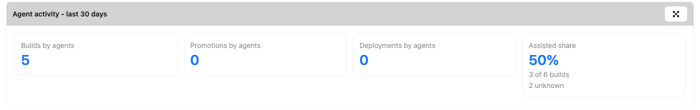

# Agent activity

!!! note "Licensed feature"

    This widget is part of the *Agent governance* feature (`extension.agents`) — see
    [Licensing](../../appendix/licensing.md#agent-governance). Without it, the widget says that the
    license is needed.

**Key:** `extension/agents/AgentActivity`

How much of the delivery the [agents](../../agents/index.md) drive over the last 7, 30 or 90 days,
across the projects you can see. Each tile opens the
[latest agent actions](../../agents/index.md#latest-agent-actions), filtered on what it counts.



| Field | Type | Default | Description |
|-------|------|---------|-------------|
| `window` | int | `30` | Number of days the counts are over, ending now: `7`, `30` or `90`. |
| `projects` | list of strings | | Names of the projects to count - all the projects you can see when empty. |
| `labels` | list of strings | | Labels the projects must all carry, as `category:name` (`name` for a label without a category). |

The tiles are described in [Agent activity across the projects](../../agents/index.md#agent-activity-across-the-projects).

For example, in [Dashboards as Code](../dashboards-as-code.md):

```yaml
- key: "extension/agents/AgentActivity"
  layout: {x: 0, y: 0, w: 12, h: 12}
  config:
    window: 30
    labels:
      - "team:platform"
```
