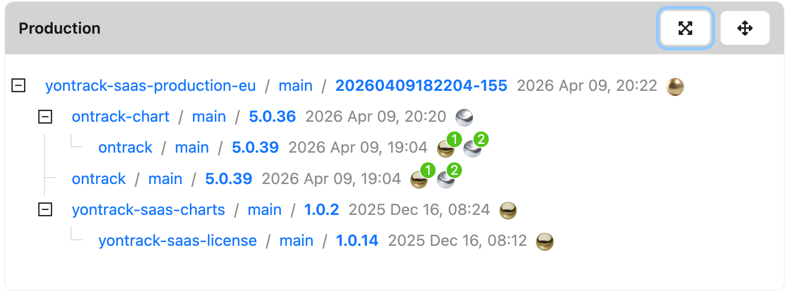

# Build dependencies tree

The **Build dependencies tree** widget displays the downstream dependency tree of the latest build promoted to a configured promotion level.

## Configuration

| Field | Description |
|---|---|
| **Title** | Label shown in the widget header. Defaults to "Build dependencies". |
| **Promotion level** | The promotion level to watch, selected via a cascading project → branch → promotion level picker. |

## Display

Once configured, the widget fetches the latest build promoted to the selected promotion level and renders its full downstream dependency tree. Each node shows the project, branch, build name, creation date, and current promotions.

The tree is expanded by default and supports up to 5 levels of downstream dependencies.

## Empty state

If no build has been promoted to the configured promotion level yet, the widget displays a message indicating that there is no promoted build.
