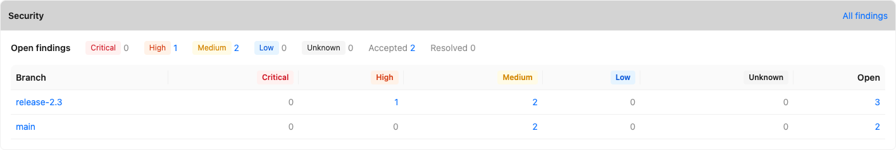
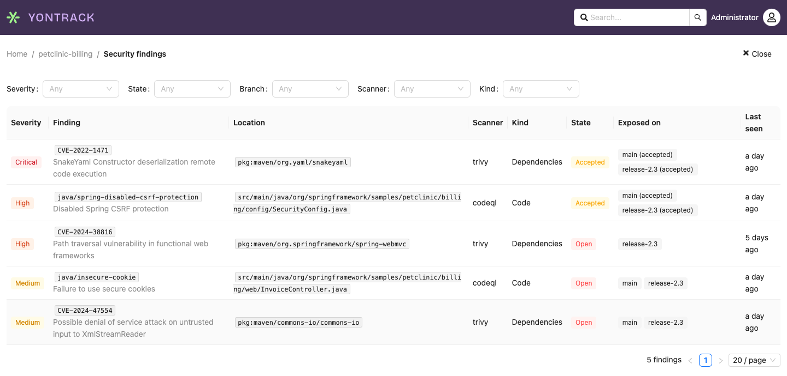
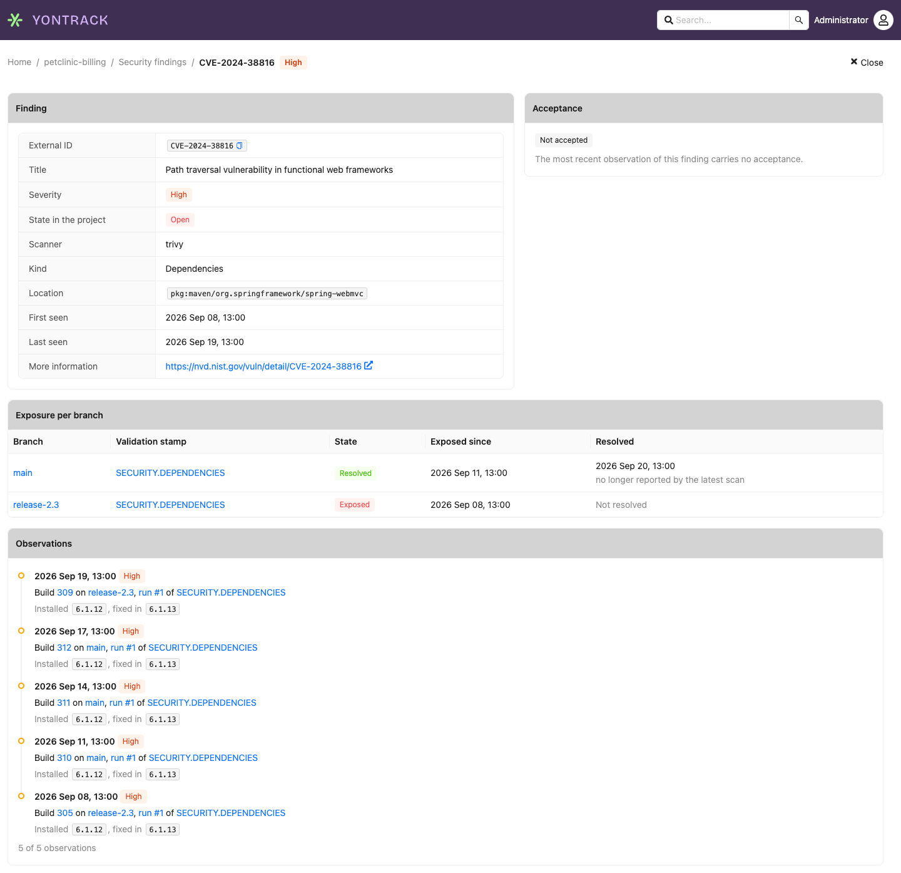

# Security findings

Yontrack records the **findings** of the security scans run by your pipelines — image scans, code
analysis, secret detection, DAST — and follows each of them over time, on every branch: when it
appeared, where it is still exposed, when it was fixed.

A scan is sent as the report of a [validation](../../concepts/model/index.md#validation-runs):
the validation run gets its status from the counts by severity, as a
[CHML](../../concepts/model/index.md#chml) run would, and the findings themselves are kept.

!!! note

    The findings, their pages, their events and the neutral format are available to everyone. Only
    the reading of native scanner formats — SARIF and Trivy JSON — is under license. See
    [License](#license).

## The model

**Finding**
:   One known weakness — a vulnerability, a code issue, a secret, a DAST alert — at one location of
    one project. A finding is identified by its **scanner**, its **external ID** (a CVE, a rule ID…)
    and its **location** (a package, a file, a URL…). The same CVE in two packages makes two
    findings.

**Observation**
:   One sighting of a finding by one scan of one build. The observation carries what the scan saw
    at that time: the severity, the installed and fixed versions, the acceptance.

**Exposure**
:   A finding is **exposed** on a branch while the latest scan of the same validation stamp on that
    branch reports it.

**Acceptance**
:   A decision, recorded outside Yontrack and read by it, that a finding is tolerated, possibly
    until an expiry date.

**Resolution**
:   A finding exposed on a branch is **resolved** there when the latest scan of the same validation
    stamp on that branch no longer reports it. The reason of the resolution is recorded as `ABSENT`.

The **kind** of a finding says what was scanned: `IMAGE`, `CODE`, `SECRETS`, `DAST`,
`DEPENDENCIES` or `OTHER`.

Its **severity** is one of `CRITICAL`, `HIGH`, `MEDIUM`, `LOW` or `UNKNOWN`, the severity the
scanner used being kept beside it as the _raw severity_.

### Exposure on a branch

Exposure is followed per branch and per validation stamp: a scan only speaks for its own stamp on
its own branch. A scan of `SECURITY.IMAGE` on `main` never resolves what `SECURITY.CODE` reported,
nor what `SECURITY.IMAGE` reported on `release/1.0`.

On a branch, a finding is in one of three states:

| State      | Meaning                                                                       |
|------------|-------------------------------------------------------------------------------|
| `EXPOSED`  | The latest scan reports it, without acceptance                                |
| `ACCEPTED` | The latest scan reports it, with an acceptance which has not expired          |
| `RESOLVED` | The latest scan no longer reports it                                          |

When the finding comes back on a branch where it was resolved, it is exposed again, and flagged as
_reopened_.

!!! note

    The expiry of an acceptance is evaluated when the finding is read, not by a background job. An
    acceptance past its expiry stops counting from that day on, and the finding is shown as
    exposed. The [new finding event](#events) fires at the next scan reporting the finding without
    a valid acceptance.

### Project roll-up

At the level of the project, a finding is:

* `OPEN` when it is exposed on at least one branch
* `ACCEPTED` when it is not open, but accepted on at least one branch
* `RESOLVED` otherwise

Only some branches count for this roll-up:

* a **disabled branch** keeps its exposure, visible on the finding page, but is left out of the
  state of the project. Enabling it again brings it back.
* when the project has a branching model, only the branches matching it count.
* a **deleted branch** takes its exposure with it. Nothing was fixed, so no
  [resolution event](#events) is sent.

### Versions and locations

For a package, the location is its [package URL](https://github.com/package-url/purl-spec)
**without its version and its qualifiers**: `pkg:maven/org.yaml/snakeyaml`, not
`pkg:maven/org.yaml/snakeyaml@1.33?type=jar`. The installed version is recorded on the observation.

This way, bumping a package to a version which is still vulnerable keeps the same finding open: a
finding is resolved when it is fixed, not when its package is bumped.

Yontrack strips the version and the qualifiers itself, in every format: a report giving a versioned
package URL as location is accepted, and the version is then used as the installed version if none
is given.

### The validation stamp type

The findings of a scan are sent to a validation stamp whose type is **Security findings**. In the
[CI configuration](../../configuration/ci-config.md), its alias is `security-findings`, and its
configuration is the one of the [CHML](../../concepts/model/index.md#chml) type:

```yaml
version: v1
configuration:
  defaults:
    branch:
      validations:
        SECURITY.IMAGE:
          security-findings:
            warningLevel: HIGH
            warningValue: 1
            failedLevel: CRITICAL
            failedValue: 1
```

The status of the run is computed from the number of findings the scan reports at each severity:

* `FAILED` when the number of findings of severity `failedLevel` is at least `failedValue`
* else, `WARNING` when the number of findings of severity `warningLevel` is at least `warningValue`
* else, `PASSED`

A value of `0` disables its threshold.

!!! warning

    As for CHML, a threshold counts the findings of **exactly** its severity, not of this severity
    and above. With `failedLevel: HIGH`, a report with only `CRITICAL` findings does not fail.
    Set the failure on `CRITICAL` and the warning on `HIGH`, as above, to be warned from the first
    `HIGH` and to fail from the first `CRITICAL`.

The counts ignore two kinds of findings:

* the **accepted** findings, which are counted apart, as _accepted_
* the findings of `UNKNOWN` severity, which are counted and displayed, but never trip a threshold

A stamp switched from the CHML type to the Security findings type keeps the history of its chart:
both store their counts the same way. A stamp switched from another type, such as a number of
findings, has no counts by severity to carry over, and its chart starts again.

!!! note

    The findings only come with a report, as described below. A run created from the validation
    dialog of the UI carries no findings, and its status is the one chosen in the dialog.

## Sending a report

A report is sent with the `validateBuildWithFindings` GraphQL mutation, usually through the
[CLI](#the-cli). It is read, and its findings stored, in one go: when the mutation returns, the
validation run, its findings and their exposure are all written, and the [events](#events) have
been sent. A report which cannot be read creates no validation run and fails the call, and with
it the step of your pipeline.

Three formats are accepted:

| Format     | What                                   | License required |
|------------|----------------------------------------|------------------|
| `findings` | The [neutral format](#neutral-format) of Yontrack | No      |
| `sarif`    | [SARIF 2.1](#sarif-21)                 | Yes              |
| `trivy`    | [Trivy JSON](#trivy-json), vulnerabilities only | Yes     |

### The CLI

The [Yontrack CLI](https://github.com/yontrack/yontrack-cli), from version 5.8.0, sends a report
with `yontrack validate … findings`:

```bash
yontrack validate --project <project> --branch <branch> --build <build> --validation <validation> \
    findings \
        --format trivy \
        --kind IMAGE \
        --report trivy.json
```

* `--format` (required) - `findings`, `sarif` or `trivy`
* `--kind` (required) - what was scanned: `IMAGE`, `CODE`, `SECRETS`, `DAST`, `DEPENDENCIES` or
  `OTHER`
* `--scanner` - name of the scanner, overriding the one Yontrack reads from the report
* `--report` (required) - path to the report, a JSON file

The CLI does not read the report: it sends it as it is, and Yontrack parses it. The other options
of `yontrack validate` — the description, the run info — apply as for any validation. In a pipeline
configured as described in [Feeding Yontrack](../../start/feeding.md), `--project`, `--branch`
and `--build` can be left out.

### GraphQL

The mutation takes the same information:

```graphql
mutation ($report: JSON!) {
  validateBuildWithFindings(input: {
    project: "my-project"
    branch: "main"
    build: "42"
    validation: "SECURITY.IMAGE"
    format: "trivy"
    kind: IMAGE
    report: $report
  }) {
    validationRun { id runOrder }
    errors { message }
  }
}
```

where the `report` variable is the content of the report, as JSON — not as a string.

* `scanner` and `kind` are optional here, and override those given by the report. The SARIF and
  Trivy formats cannot give the kind, which must then be passed.
* `description`, `runInfo` and `dateTime` (the time of the scan, now by default) are optional.
* the caller needs to be allowed to validate builds of the project.

A report which cannot be read, or needs a license the instance does not have, comes back in
`errors`, listing up to 20 of its problems by field — never by value.

### Neutral format

The `findings` format is Yontrack's own. It is the one to use when writing a converter for a scanner
Yontrack does not read natively — or for anything else, such as the alerts of a code hosting
service.

```json
{
  "scanner": "zap",
  "kind": "DAST",
  "findings": [
    {
      "externalId": "10038",
      "location": "",
      "severity": "MEDIUM",
      "rawSeverity": "Medium",
      "title": "Content Security Policy (CSP) Header Not Set",
      "url": "https://www.zaproxy.org/docs/alerts/10038/",
      "fixedVersion": null,
      "installedVersion": null,
      "acceptance": {
        "statement": "Served behind a proxy setting the header",
        "expiresAt": "2026-12-31",
        "source": "security/dast/suppressions.yaml"
      }
    }
  ]
}
```

| Field                                 | Required | Description                                                        |
|---------------------------------------|----------|--------------------------------------------------------------------|
| `scanner`                             | (1)      | Name of the scanner                                                |
| `kind`                                | (1)      | `IMAGE`, `CODE`, `SECRETS`, `DAST`, `DEPENDENCIES` or `OTHER`      |
| `findings`                            | Yes      | List of findings, possibly empty                                   |
| `findings[].externalId`               | Yes      | ID given by the scanner: a CVE, a rule ID…                         |
| `findings[].location`                 | Yes      | Where the finding is, possibly empty. See the conventions below    |
| `findings[].severity`                 | Yes      | `CRITICAL`, `HIGH`, `MEDIUM`, `LOW` or `UNKNOWN`                   |
| `findings[].title`                    | Yes      | Short description                                                  |
| `findings[].rawSeverity`              | No       | Severity as given by the scanner                                   |
| `findings[].url`                      | No       | Link to the description of the finding                             |
| `findings[].installedVersion`         | No       | Version of the package found by the scan                           |
| `findings[].fixedVersion`             | No       | Version of the package fixing the finding                          |
| `findings[].acceptance`               | No       | The finding is [accepted](#acceptance)                             |
| `findings[].acceptance.statement`     | Yes      | Why the finding is accepted, possibly empty                        |
| `findings[].acceptance.source`        | Yes      | Where the acceptance is recorded, for example a file of your repository |
| `findings[].acceptance.expiresAt`     | No       | Date the acceptance expires, as `yyyy-MM-dd`                       |

(1) Required either in the report or as an argument of the call. The argument wins. The CLI always
passes `--kind`, which is mandatory there, and passes `--scanner` when given.

The values of `kind` and `severity` are case-sensitive, and **unknown fields are rejected**: the
format has no place for a secret value, and a converter cannot add one by mistake.

The JSON schema of this format, with the key `findings`, can be downloaded from the _Resources_ page
of the user menu — see [JSON schemas](../../appendix/json-schemas.md).

#### Location conventions

The location is part of the identity of a finding: a scan reporting another location for the same
issue makes another finding. For a converter to produce stable findings, follow these conventions:

| Kind of finding            | Location                                               | Example                        |
|----------------------------|--------------------------------------------------------|--------------------------------|
| A dependency, a package    | Its package URL, without version nor qualifiers        | `pkg:npm/lodash`               |
| A code issue               | The path of the file, without line nor column          | `src/main/java/App.java`       |
| A DAST rule                | Empty: the rule is the finding                         | `""`                           |
| A secret                   | The number of the alert in the provider, never the value | `42`                         |

Several entries with the same external ID and location in one report are merged into one finding,
keeping an unaccepted entry before an accepted one, then the most severe one.

### SARIF 2.1

`sarif` reads the [SARIF 2.1](https://docs.oasis-open.org/sarif/sarif/v2.1.0/sarif-v2.1.0.html)
format, written by CodeQL, Semgrep, Trivy and many others.

The `kind` must be given with the call: a SARIF file cannot say whether it comes from the scan of an
image, of a file system or of dependencies. It applies to all the runs of the file.

| Finding          | Read from                                                                                                   |
|------------------|-------------------------------------------------------------------------------------------------------------|
| scanner          | `runs[].tool.driver.name`, lowercased — `CodeQL` gives `codeql`. Required as argument when the file has no run, a run has no name, or the runs have different names |
| external ID      | `result.ruleId`, else the ID of its rule                                                                   |
| location         | The `artifactLocation.uri` of the first location of the result, **without its region**: no line, no column. Empty when there is none |
| title            | `shortDescription` of the rule, else its `name`, else its ID                                                |
| URL              | `helpUri` of the rule                                                                                       |
| severity         | See [below](#sarif-severity)                                                                                |
| acceptance       | See [below](#sarif-acceptance)                                                                              |

Because the location has no line, several results of one rule in one file make **one** finding:
moving code around does not open new findings.

Results whose `kind` is `pass` or `notApplicable`, and results whose `baselineState` is `absent`,
are skipped.

!!! note

    Yontrack **never reads** the `message` of a result, nor the `snippet` or `contextRegion` of its
    locations. That is where a secret scanner puts the secret.

#### SARIF severity

The severity follows what GitHub code scanning shows:

1. a `security-severity` score in the `properties` of the result, else of its rule:

    | Score        | Severity   |
    |--------------|------------|
    | 9.0 and more | `CRITICAL` |
    | 7.0 to 8.9   | `HIGH`     |
    | 4.0 to 6.9   | `MEDIUM`   |
    | above 0      | `LOW`      |

2. else, the `level` of the result, else the default level of its rule:

    | Level              | Severity  |
    |--------------------|-----------|
    | `error`            | `HIGH`    |
    | `warning`          | `MEDIUM`  |
    | `note`             | `LOW`     |
    | `none`, or absent  | `UNKNOWN` |

The raw severity records what was read: `security-severity=7.5` or `level=error`.

#### SARIF acceptance

A result is accepted when one of its `suppressions` has the status `accepted`, or no status, and
none of them is `underReview` or `rejected`.

* the statement is the `justification` of the suppression
* the source is the file of the suppression when it has a location, else `SARIF suppression (<kind>)`,
  for example `SARIF suppression (inSource)`
* there is no expiry: SARIF has no field for it

### Trivy JSON

`trivy` reads the JSON report of [Trivy](https://trivy.dev/) (`--format json`, schema version 2).

**Only the vulnerabilities are read** (`Results[].Vulnerabilities[]`). The secrets, the
misconfigurations and the licenses are ignored — Trivy's secret results carry the matched text.

The `kind` must be given with the call, since the same report is written for an image, a file system
or a repository. The scanner is `trivy`, unless given with the call.

| Finding           | Read from                                                                                 |
|-------------------|-------------------------------------------------------------------------------------------|
| external ID       | `VulnerabilityID`                                                                         |
| location          | `PkgIdentifier.PURL`, without version nor qualifiers. When there is no package URL, `PkgName` — which is **not** a package URL |
| installed version | `InstalledVersion`                                                                        |
| fixed version     | `FixedVersion`                                                                            |
| severity          | `Severity`, whose values are Yontrack's — including `UNKNOWN`                              |
| raw severity      | `Severity (SeveritySource)`, for example `HIGH (nvd)`                                      |
| title             | `Title`, else the external ID                                                             |
| URL               | `PrimaryURL`                                                                              |

**Acceptance** is read from the `ExperimentalModifiedFindings` of a result — which Trivy writes only
when run with `--show-suppressed` — for the vulnerabilities whose `Status` is `ignored` (from an
ignore file) or `not_affected` (from a VEX document):

* the statement is the `Statement` of the modified finding
* the source is its `Source`, for example `.trivyignore.yaml`
* there is no expiry: Trivy does not report it. Trivy itself stops honouring an expired entry, and
  the finding then comes back as exposed at the next scan.

!!! note "Why Trivy JSON rather than Trivy's SARIF"

    Trivy's SARIF output gives as location the path of the package or the scanned target, never the
    package URL, and the CVE as rule. One CVE in two packages of the same image would then collapse
    into one finding, and the installed version would be lost. Trivy JSON keeps them apart.

## Acceptance

Yontrack does not decide which findings are acceptable: the decision stays with the files your
scanners read — a `.trivyignore.yaml`, a VEX document, a SARIF suppression, the dismissals of your
code hosting service — and Yontrack reads it from the report.

An accepted finding:

* is counted apart, as _accepted_, and never trips a threshold of its validation stamp
* is shown with its statement, its source and its expiry
* fires no event when it is first seen already accepted
* is shown as exposed once its acceptance has expired, and counts again in the thresholds from the
  next scan

## License

The reading of **native scanner formats** — SARIF and Trivy JSON, and any native format to come — is
under license, as the feature `extension.findings.native-formats` ("Native scanner formats").

Without it:

* a report in the `sarif` or `trivy` format is rejected, naming the feature, and no validation run is
  created: the step of your pipeline fails
* everything else keeps working: the neutral `findings` format, the findings pages, the search, the
  events, the GraphQL API

A license which lapses stops the new native reports only. The findings already stored stay
readable, and keep being resolved by scans sent in the neutral format.

## Worked examples

### Trivy image scan

Scan the image into a JSON report, including the accepted vulnerabilities:

```bash
trivy image \
    --format json \
    --output trivy.json \
    --show-suppressed \
    --ignorefile .trivyignore.yaml \
    my-registry/my-app:1.2.3
```

To accept a vulnerability, record it in an ignore file, passed to the scan with
`--ignorefile .trivyignore.yaml`:

```yaml
vulnerabilities:
  - id: CVE-2022-1471
    statement: SnakeYAML is only used to read our own configuration files
    expired_at: 2026-12-31
```

Then send the report:

```bash
yontrack validate --validation SECURITY.IMAGE \
    findings \
        --format trivy \
        --kind IMAGE \
        --report trivy.json
```

The `SECURITY.IMAGE` run is then `FAILED` if the image has a `CRITICAL` vulnerability, `WARNING` if
it has a `HIGH` one, with the thresholds of the [configuration above](#the-validation-stamp-type).
`CVE-2022-1471` is counted as accepted until the end of 2026 — after which Trivy stops ignoring
it, and the next scan reports it as exposed.

!!! tip

    Without `--show-suppressed`, the accepted vulnerabilities are simply not in the report, and
    Yontrack sees them as absent: they are resolved rather than accepted.

### CodeQL

In a GitHub workflow, let CodeQL write its SARIF files to a directory, and send the one of each
language:

```yaml
- name: CodeQL analysis
  uses: github/codeql-action/analyze@v4
  with:
    output: codeql-results

- name: Findings
  run: |
    yontrack validate --validation SECURITY.CODE \
      findings \
        --format sarif \
        --kind CODE \
        --report codeql-results/java.sarif
```

CodeQL's security queries give a `security-severity` to their rules, so the severities are the ones
GitHub code scanning shows. The scanner is `codeql`, the external ID the ID of the query, such as
`java/sql-injection`, and the location the file.

!!! note

    The alerts dismissed in GitHub code scanning are **not** in the SARIF file: CodeQL does not know
    about them. Sent as SARIF, they come back as exposed. When the dismissals must count, read the
    open and dismissed alerts from the code scanning API instead, and send them in the
    [neutral format](#neutral-format), a dismissal becoming an acceptance.

## Reading the findings

Seeing the findings of a project requires the `ProjectFindingsView` function on this project, on top
of seeing the project itself.

By default, every built-in role which can see a project can see its findings. The function is kept
apart so that it can be withheld from a role — for example, when the DAST findings of a live
deployment are sensitive.

In the UI:

* the **Security** section of the project page shows the open findings by severity, the number of
  accepted and resolved ones, and the branches with open findings. Each figure opens the findings
  page, filtered.

    

* the **findings page** of the project lists them, filtered by severity, state (open, accepted,
  resolved), branch, scanner and kind.

    

* the **finding page** shows a finding's exposure per branch, the timeline of its observations, its
  acceptance with statement and expiry, and the link to its description. Below, a vulnerability
  fixed on `main` and still exposed on `release-2.3`:

    

* the page of a **validation run** lists the findings of this scan.
* the **search** finds a finding by its external ID: searching `CVE-2021-44228` lists the projects and
  branches where it is exposed or accepted, and leads to the finding page.

!!! note

    The [mobile UI](../../mobile/index.md) does not show findings.

Through the [GraphQL API](../../api/graphql.md):

* `Project.findings(filter)` lists the findings of a project, paginated, most severe first, with the
  same filters as the findings page
* `Project.findingsSummary` gives the counts the Security section shows
* `ValidationRun.findings` lists the observations of a scan
* `findings(externalId)` lists the findings with this external ID, across all the projects you can
  see the findings of
* `finding(id)` gets one finding

## Events

Two [events](../../generated/events/index.md) follow the exposure of findings on branches:

* [`security_finding_new`](../../generated/events/event-security_finding_new.md) - a finding becomes
  exposed on a branch where it was not. When it was there before — resolved, or accepted — its
  `REOPENED` field is `true`.
* [`security_finding_resolved`](../../generated/events/event-security_finding_resolved.md) - a finding
  exposed on a branch is no longer reported by the latest scan of its validation stamp there.

The events speak for the branch, all its validation stamps together: a finding reported by two
stamps of a branch is new when the first one reports it, and resolved when neither does any more.

Their entity is the branch. A [subscription](../notifications/index.md) on the `main` branch
answers "tell me of any new finding on `main`", and one on the project sees all its branches.

The keywords of a subscription are matched against the values of the event, so they can narrow it
down: `critical` keeps the `CRITICAL` findings only, `codeql` the findings of CodeQL. All the
keywords of a subscription must match, so one subscription follows one severity.

There is no event per observation: scanning a build which reports the same findings as the previous
one sends nothing.

## Metrics

The time taken to read and store a report, and its number of findings, are published as
[metrics](../../generated/metrics/net.nemerosa.ontrack.extension.findings.metrics.FindingsMetrics.md),
tagged by format.
