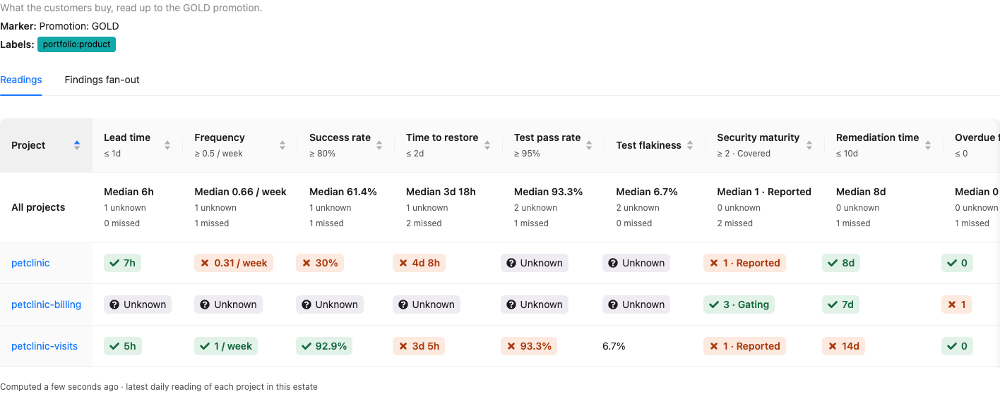
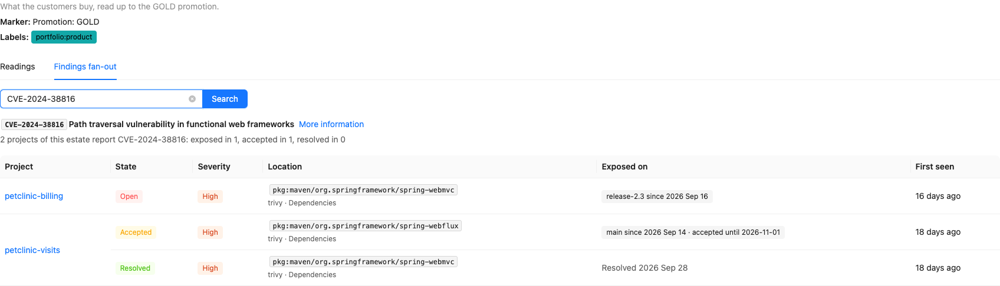

# Estate view

!!! warning

    This feature is under license: see [License](#license).

The [scorecard](scorecard.md) of a project answers "how is this project delivering?". The **estate
view** asks it of every project of an [estate](estates.md) at once — their readings side by side,
against the targets of the estate — and answers a second question the security findings raise:
"which of these projects are exposed to this CVE?".

## Scorecards

**Scorecards**, in the *Information* group of the user menu, lists the estates:

* the name, which opens the estate page, and the description,
* the labels,
* the marker,
* the number of projects the estate selects.

There is no estate of all the projects: the readings of a project on its own are on its
[project page](scorecard.md#on-the-project-page). The estates themselves are managed on the
[estates page](estates.md#the-estates-page).

## The estate page

The page of an estate, at `/extension/scorecard/estate/<name>`, says what the estate is — its
description, its marker and its labels — and has two tabs: **Readings** and **Findings fan-out**.

### Readings

One row per project of the estate — among the projects you can see — and one column per reading of
the [catalogue](scorecard.md#the-readings), in its order. The heading of a column gives the target
the estate sets for the reading, if any.

Each cell is the latest daily reading of the project in the set of the estate:

* **Met**, with a check, or **Missed**, with a cross, when the estate judges the reading: in the
  colour of the judgement, which never stands alone;
* the value alone, when the estate sets no target for the reading;
* **Unknown**, in grey, when the reading could not be taken: its
  [reason](scorecard.md#unknown-readings) shows on hover and on keyboard focus;
* **No failure**, neutral, for a time to restore with nothing to restore in the window, and
  **No target set**, neutral, for overdue findings with no remediation target to judge them against
  — their reason shows on hover and on keyboard focus too;
* a dash when the readings of the project have not been computed yet.

The **All projects** row, at the top, rolls each reading up over the projects: the median of the
values of the projects which have one, the number of projects whose reading is unknown, and the
number of projects missing the target. The neutral readings — *No failure*, *No target set* — are
neither counted as unknown nor part of the median, and neither are the projects not computed yet.
A median of rungs or of counts may fall between two of them, and keeps its half: *Median 1.5*.

A click on the heading of a column sorts the projects by that reading, the projects with no value
last whatever the order; by default, they are sorted by name. The name of a project opens its
scorecard page on the set of the estate, where each reading explains its value.



Above, the projects of the demo's *Demo products* estate: `petclinic-billing` is *gating* its
security scans and fixes its findings within the target, but has a `HIGH` finding open for longer
than the estate allows, while `petclinic-visits` only scans its dependencies where the estate
expects its code to be scanned too.

A switch showing the measured readings only appears once a project of the estate holds an
`ESTIMATED` reading — which Yontrack 6 never produces, so it is not shown.

### Findings fan-out

The **Findings fan-out** tab searches one [security finding](../integrations/findings/findings.md)
among the projects of the estate, by its external ID — a CVE, a rule ID — as the scanner gives it.
Only the projects you can see, and whose findings you are granted the view of
(`ProjectFindingsView`), are searched.

The finding is given with its title and a link to its description, and a summary: *2 projects of
this estate report CVE-2024-38816: exposed in 1, accepted in 1, resolved in 0* — each project counted
once, by its most exposed finding.

Then one row per finding — a project has one per scanner and location — grouped by project, the
projects where the finding is open first, then the ones where it is accepted, then the ones where it
is resolved:

* its **state** in the project — open, accepted or resolved, see
  [Project roll-up](../integrations/findings/findings.md#project-roll-up);
* its **severity**, the highest it was reported with;
* its **location**, with the scanner and the kind of scan, which opens the finding page;
* **Exposed on**: the branches exposing it, each since the start of its exposure, and *accepted
  until* the expiry of its acceptance — or *accepted without expiry*. A branch where the finding is
  resolved is not listed; a finding resolved in the project reads *Resolved* and its date;
  a branch which does not count toward the state of the project — outside the branch model of the
  project, or disabled, see [Project roll-up](../integrations/findings/findings.md#project-roll-up)
  — is still listed, greyed with a dashed border, after the branches which count, and says why on
  hover and on keyboard focus: *Outside the branch model: does not count toward the project's
  state*. The state of the project and the summary are the ones of the branches which count, so
  that a project may read *Resolved* while it lists such a branch. A project without SCM has no
  branch model: all its branches count;
* when it was **first seen**.



Above, the demo's `CVE-2024-38816`: still exposed on the `release-2.3` branch of
`petclinic-billing` — it was fixed on `main` — and, in `petclinic-visits`, accepted on
`spring-webflux` and resolved on `spring-webmvc`.

## License

The estate view needs the **Delivery scorecard** feature (`extension.scorecard`) of the license,
like the [estates](estates.md#license). Without it, the *Scorecards* entry is not in the user menu.

The estate view is on the desktop UI only: the [mobile UI](../mobile/index.md) does not show it.

## API

In GraphQL, `Estate.projectSets` gives the set of the estate of each of its projects — the readings
the estate page shows — and `Estate.findings(externalId)` the findings of an external ID among its
projects:

```graphql
{
  estate(name: "Demo products") {
    projectSets {
      project { name }
      readings { key value basis unknownReason target targetMet }
    }
    findings(externalId: "CVE-2024-38816") {
      project { name }
      location
      state
      maxSeverity
      firstSeen
      resolvedAt
      exposures { branch { name } since state counts acceptanceExpiresAt }
    }
  }
}
```

`counts` says whether the branch of an exposure counts toward the state of the finding in its
project — the `state` of the finding is rolled up from these branches only.
