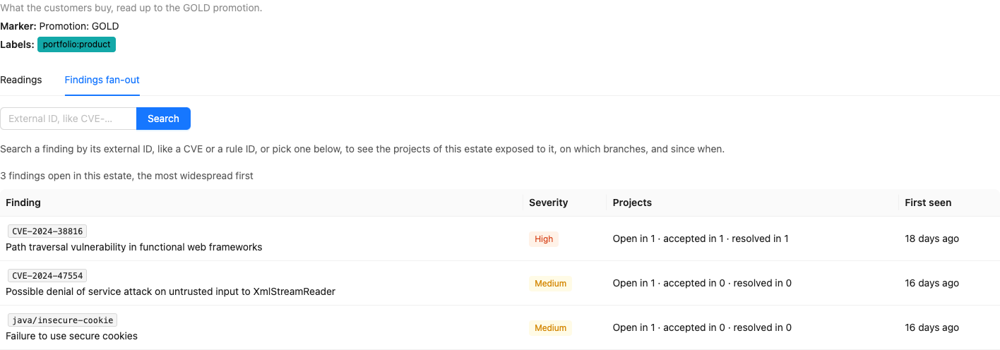

# Estate view

!!! warning

    This feature is under license: see [License](#license).

The [scorecard](scorecard.md) of a project answers "how is this project delivering?". The **estate
view** asks it of every project of an [estate](estates.md) at once — their readings side by side,
against the targets of the estate — and answers a second question the security findings raise:
"which of these projects are exposed to this CVE?".

## Scorecards

**Scorecards**, in the *Information* group of the user menu, lists the estates:

* the name, which opens the estate page, and the description,
* the labels,
* the marker,
* the number of projects the estate selects.

There is no estate of all the projects: the readings of a project on its own are on its
[project page](scorecard.md#on-the-project-page). The estates themselves are managed on the
[estates page](estates.md#the-estates-page).

## The estate page

The page of an estate, at `/extension/scorecard/estate/<name>`, says what the estate is — its
description, its marker and its labels — and has two tabs: **Readings**, the default one, and
**Findings fan-out**.

The address of the page keeps the tab, the finding and the text searched, so that a fan-out or a
search is shared by its link: `/extension/scorecard/estate/<name>?tab=fanout&finding=CVE-2024-38816`
opens the fan-out of `CVE-2024-38816`, `?tab=fanout&search=cve-2024` the findings whose external ID
contains `cve-2024`, and a reload lands on the same page.

### Readings

One row per project of the estate — among the projects you can see — and one column per reading of
the [catalogue](scorecard.md#the-readings), in its order. The heading of a column gives the target
the estate sets for the reading, if any, and an ⓘ which says what the reading measures — up to the
marker of the estate — and its target in words: *Target of this estate: 2d or less — met at or
under it, missed above*, or that the estate sets none, the values being shown and not judged. The
ⓘ of the security maturity lists its four [rungs](scorecard.md#security-readings), the target one
marked, and words *Covered* in the terms of the estate: the kinds of scan it expects and its
freshness. An ⓘ opens on hover and on keyboard focus, and never sorts the column.

The readings read as a heatmap: each cell is a block of the same size, the latest daily reading of
the project in the set of the estate, filled with the colour of its judgement — so that the
projects which struggle, and on what, show before any value is read:

* **Met**, green with a check, or **Missed**, orange with a cross, when the estate judges the
  reading — the colour never stands alone;
* **neutral**, a grey fill, when the reading is not judged: the value alone when the estate sets no
  target for the reading, **No failure** for a time to restore with nothing to restore in the
  window, and **No target set** for overdue findings with no remediation target to judge them
  against;
* **Unknown**, a dashed outline with a question mark and no fill, so that it never looks judged,
  when the reading could not be taken;
* a dash when the readings of the project have not been computed yet.

A cell gives its value in short — the security maturity reads its rung, *2 · Covered* — and its
hover, or its keyboard focus, the project, the reading, its full value and the target of the
estate. The hover of an unknown or neutral reading gives its [reason](scorecard.md#unknown-readings)
too, and the one of a security maturity what its rung means. The line under
the table names each judgement with its icon and its swatch.

The **Summary** column, on the right, sums each project up: a thin bar of its readings by judgement
— missed, met, neutral, unknown — and how many of its judged readings are met, *3 of 5 met*, the
neutral and unknown readings not being judged. The bar spells its counts out to a screen reader.

The **All projects** row, at the top, rolls each reading up over the projects: the median of the
values of the projects which have one, above the same thin bar of the projects by judgement, and
their counts in one line: the mark of each judgement and its number, the zeros left out, in words
on hover — *1 missed · 2 met*. The neutral readings — a value
with no target, *No failure*, *No target set* — are neither unknown nor part of the median, and the
projects not computed yet are counted nowhere. A median of rungs or of counts may fall between two
of them, and keeps its half: *Median 1.5*. The ⓘ next to *All projects* says what the row counts.

The worst projects come first: by default, the projects are sorted by their number of missed
readings, the most first, then by name. A click on the heading of the *Summary* column turns this
order around; a click on the heading of a reading sorts the projects by its value, the projects with
no value last whatever the order, and one on *Project* by name. The name of a project, fixed on the
left, opens its scorecard page on the set of the estate, where each reading explains its value.


Above, the projects of the demo's *Demo products* estate, the worst first: `petclinic` and
`petclinic-visits` each miss four targets, `petclinic-billing` one. `petclinic-billing` is *gating* its
security scans and fixes its findings within the target, but has a `HIGH` finding open for longer
than the estate allows, while `petclinic` and `petclinic-visits` only scan their dependencies where
the estate expects their code to be scanned too. `petclinic-visits` requires its dependency scan for
its `SILVER` promotion, which is *gating* as well, but each rung of the maturity needs the ones below
it: not covered here, it reads *1 · Reported* — and *3 · Gating* in the *Demo production* estate,
which expects a dependency scan only.

A switch showing the measured readings only appears once a project of the estate holds an
`ESTIMATED` reading — which Yontrack 6 never produces, so it is not shown.

### Findings fan-out

The **Findings fan-out** tab follows one [security finding](../integrations/findings/findings.md)
over the projects of the estate. Only the projects you can see, and whose findings you are granted
the view of (`ProjectFindingsView`), are looked into.

#### The most widespread findings

Until a finding is searched, the tab answers "which finding hurts the most projects of this
estate?": it lists the findings open in at least one of its projects, one row per external ID, by
the number of projects of the estate in which they are open, then by severity — the highest a
project reported it with — then by external ID. Each row gives:

* the **external ID** and the title of the finding;
* its **severity**;
* the number of **projects** in which it is open, accepted and resolved: *Open in 3 · accepted in 1
  · resolved in 0* — each project counted once, by its most exposed finding, and the state of the
  finding in a project rolled up from the branches which count only, see
  [Project roll-up](../integrations/findings/findings.md#project-roll-up);
* when it was **first seen**, in any of these projects.

The list stops at the 20 most widespread findings. A click on a row opens the fan-out of its
finding; *All open findings* goes back to the list.



Above, the findings open in the demo's *Demo products* estate: each is open in one project only, so
the `HIGH` comes first — `CVE-2024-38816`, also accepted in a second project and resolved in a third.

#### Searching a finding

The search box looks for the findings whose external ID — a CVE, a rule ID — contains the text
typed, ignoring case: `38816`, `cve-2024` or `csrf` work as well as the whole external ID. The
findings found may be open, accepted or resolved in the projects of the estate:

* when only one external ID contains the text, its fan-out opens right away;
* else, they are listed as the most widespread findings are, and ranked the same way. The list
  stops at 20 findings, and then asks for more of the external ID. A click on a row opens the
  fan-out of its finding, from which *Findings containing "…"* goes back to the list;
* when none does, the tab says so.

In the demo's *Demo products* estate, `csrf` opens the fan-out of
`java/spring-disabled-csrf-protection`, and `cve-2024` lists four findings.

#### The fan-out of a finding

The finding is given with its title and a link to its description, and a summary: *3 projects of
this estate report CVE-2024-38816: exposed in 1, accepted in 1, resolved in 1* — each project counted
once, by its most exposed finding.

Then one row per finding — a project has one per scanner and location — grouped by project, the
projects where the finding is open first, then the ones where it is accepted, then the ones where it
is resolved:

* its **state** in the project — open, accepted or resolved, see
  [Project roll-up](../integrations/findings/findings.md#project-roll-up);
* its **severity**, the highest it was reported with;
* its **location**, with the scanner and the kind of scan, which opens the finding page;
* **Exposed on**: the branches exposing it, each since the start of its exposure, and *accepted
  until* the expiry of its acceptance — or *accepted without expiry*. A branch where the finding is
  resolved is not listed; a finding resolved in the project reads *Resolved* and its date;
  a branch which does not count toward the state of the project — outside the branch model of the
  project, or disabled, see [Project roll-up](../integrations/findings/findings.md#project-roll-up)
  — is still listed, greyed with a dashed border, after the branches which count, and says why on
  hover and on keyboard focus: *Outside the branch model: does not count toward the project's
  state*. The state of the project and the summary are the ones of the branches which count, so
  that a project may read *Resolved* while it lists such a branch. A project without SCM has no
  branch model: all its branches count;
* when it was **first seen**.


Above, the demo's `CVE-2024-38816`, opened from its link
`?tab=fanout&finding=CVE-2024-38816`: still exposed on the `release-2.3` branch of
`petclinic-billing` — it was fixed on `main` — in `petclinic-visits`, accepted on `spring-webflux`
and resolved on `spring-webmvc`, and resolved in `petclinic` as a whole.

## License

The estate view needs the **Delivery scorecard** feature (`extension.scorecard`) of the license,
like the [estates](estates.md#license). Without it, the *Scorecards* entry is not in the user menu.

The estate view is on the desktop UI only: the [mobile UI](../mobile/index.md) does not show it.

## API

In GraphQL, `Estate.projectSets` gives the set of the estate of each of its projects — the readings
the estate page shows — `Estate.rankedFindings(size)` the findings open in its projects, the most
widespread first, `Estate.searchedFindings(text, size)` the findings whose external ID contains a
text, ranked the same way, and `Estate.findings(externalId)` the findings of an external ID among
its projects:

```graphql
{
  estate(name: "Demo products") {
    projectSets {
      project { name }
      readings { key value basis unknownReason target targetMet }
    }
    rankedFindings(size: 10) {
      externalId
      title
      severity
      openProjects
      acceptedProjects
      resolvedProjects
      firstSeen
    }
    searchedFindings(text: "cve-2024", size: 10) {
      externalId
      openProjects
      acceptedProjects
      resolvedProjects
    }
    findings(externalId: "CVE-2024-38816") {
      project { name }
      location
      state
      maxSeverity
      firstSeen
      resolvedAt
      exposures { branch { name } since state counts acceptanceExpiresAt }
    }
  }
}
```

`rankedFindings` returns 20 findings unless `size` says otherwise, and never more than 100: the
ranking is computed by the database over all the findings of the estate, and only its top is
returned. `searchedFindings` is bounded the same way; its text is matched ignoring case, its `%` and `_`
matching themselves, and a blank one finds nothing. `findings(externalId)` takes the whole external
ID, as stored.

`counts` says whether the branch of an exposure counts toward the state of the finding in its
project — the `state` of the finding is rolled up from these branches only.
