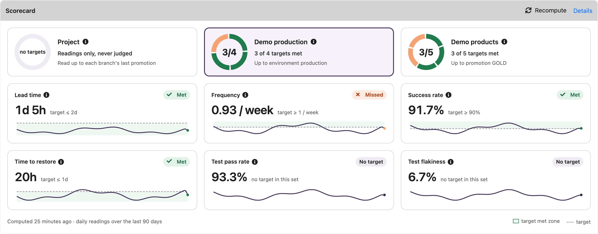
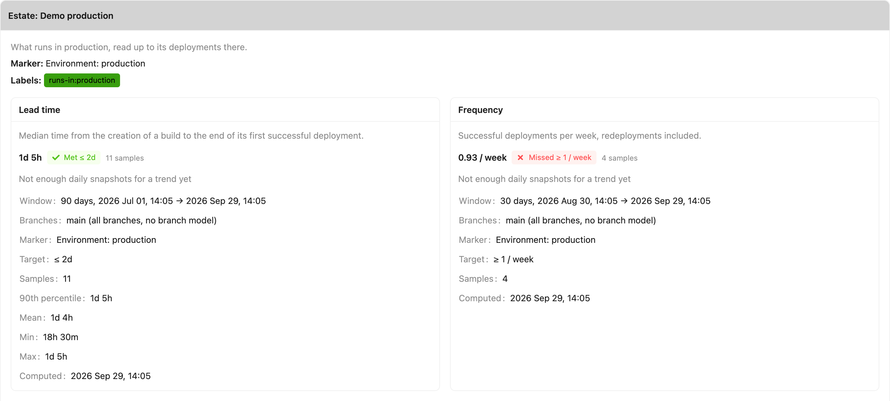

# Delivery scorecard

The **delivery scorecard** of a project answers "how is this project delivering?" with a handful of
numbers Yontrack takes from its own data — its builds, promotions, deployments, test
validations and [security scans](../integrations/findings/findings.md). Nothing is entered by hand.

!!! note

    The scorecard of a project on its own is available to everyone. Reading projects together in
    [estates](estates.md), with targets, is under license — see [License](#license).

## The model

**Reading**
:   One measurement of one project at one moment — its lead time, say — for one [set](#sets). A
    reading says what it came to, over which window, and which branches it read.

**Scorecard**
:   The readings of one project: what its project page shows.

**Set**
:   Every project is read on its own, in the **no-estate set**, shown as the *Project* set. A
    project which belongs to [estates](estates.md) is read again for each of them, against the
    estate's marker, windows and targets.

**Marker**
:   The event a delivery reading measures up to: a promotion granted, or an environment reached.

**Window**
:   The period a reading is taken over: the last 90 days by default, back from the time it is
    computed. See [Settings](#settings).

**Scope**
:   The branches a project is read on: its non-disabled branches matched by its branch model, or
    every non-disabled branch when the project has no branch model — a project with no SCM. A
    reading records its branches and which of the two cases applied.

### Basis

Every reading has a **basis**, which says what its value rests on:

| Basis       | Meaning                                                                                  |
|-------------|------------------------------------------------------------------------------------------|
| `MEASURED`  | Measured from Yontrack's own data.                                                       |
| `UNKNOWN`   | Yontrack cannot see what the reading needs. There is no value, and an [unknown reason](#unknown-readings) says why. |
| `ESTIMATED` | Reserved for imported history. Yontrack 6 never produces it.                             |

### Sets

The **no-estate set** exists for every non-disabled project. It is read up to each branch's **last
promotion level** — the last one in the order of the branch's promotion levels. Branches without
any promotion level are not read, and the samples of all the branches read are pooled together.
The no-estate set has no target: it is shown, never judged.

An estate adds a set of readings to each project it selects, with its own marker, windows and
targets. A project's no-estate readings are the same whether or not it belongs to an estate. See
[Estates](estates.md).

## The readings

Nine readings make the catalogue. The four **delivery** readings are read up to the marker; the
two **quality** readings read the test validations of the branches in scope, and the three
**security** readings their security scans and findings, whatever the marker.

| Reading       | Key                     | Unit                    | Better when |
|---------------|-------------------------|-------------------------|-------------|
| Lead time     | `delivery.leadTime`     | Duration (median)       | lower       |
| Frequency     | `delivery.frequency`    | Per week                | higher      |
| Success rate  | `delivery.successRate`  | Percentage, 0 to 100    | higher      |
| Time to restore | `delivery.mttr`       | Duration (median)       | lower       |
| Test pass rate | `quality.testPassRate` | Percentage, 0 to 100    | higher      |
| Test flakiness | `quality.testFlakiness` | Percentage, 0 to 100   | lower       |
| Security maturity | `security.maturity` | Rung, 0 to 3          | higher      |
| Remediation time | `security.remediationTime` | Duration (median) | lower      |
| Overdue findings | `security.overdue`   | Count                   | lower       |

Through the API, durations are given in **seconds**. A duration reading keeps the median as its
value; its 90th percentile, mean, minimum, maximum and sample count are in its details. There is no
minimum number of samples: the count is always shown beside the value.

### Up to a promotion

When the marker is a promotion level — always the case with no estate — on each branch read:

**Lead time**
:   From the creation of a build to its **first** promotion run at the level. A build counts in the
    window where it was first promoted.

**Frequency**
:   The promotion runs at the level in the window, every one of them, per week. The raw count is in
    the details.

**Success rate**
:   The share of the builds created in the window which were promoted at the level, leaving out the
    builds **in flight**: those created within the window's median lead time before its end. They
    have not had the time a build usually takes to be promoted, so their not being promoted says
    nothing yet. The details give the number of builds counted, promoted, and left out as in
    flight.

**Time to restore**
:   How long the path to the level stays broken. An outage starts with the **first** unpromoted
    build following a promoted one, and ends with the next promotion on that branch. For B1
    promoted, then B2, B3 and B4 not promoted, then B5 promoted, the outage goes from the creation
    of B2 to the promotion of B5. An outage counts in the window where it was restored.
    Unpromoted builds before the first promotion of a branch are not an outage — nothing was
    promoted yet to be restored — and an outage started by a build in flight is not a failure yet.
    The details also give the outages still going on at the end of the window.

### Up to an environment

When an [estate](estates.md) names an environment as its marker — or defaults to one — the
delivery readings read the deployments of the project's slot in that environment:

**Lead time**
:   From the creation of a build to the end of its **first** `DONE` deployment in the slot. A
    redeployment of the same build does not reset it.

**Frequency**
:   The `DONE` deployments in the window, per week, counted at their end. A redeployment counts.

**Success rate**
:   `DONE` over `DONE` plus [`FAILED`](../integrations/environments/environments.md#failed-deployments)
    deployments in the window. A `CANCELLED` deployment is left out entirely.

**Time to restore**
:   From a `FAILED` deployment to the next `DONE` one in the same slot; consecutive failures make
    one outage, from the first of them. It is the time to restore the **deployment path**, not an
    incident's time to restore, which Yontrack cannot see.

Only the slot with the marker's qualifier is read — the default slot, unless the estate names a
qualifier. Qualifiers are never pooled: a build deployed to a canary and then to the main slot
would be counted twice.

### Test readings

A **test stamp** is a validation stamp whose data type is
[Test summary](../concepts/model/index.md#test-summary) (`tests`). The test readings look at the
builds created in the window, on the branches in scope, which have at least one run on a test
stamp:

**Test pass rate**
:   The share of these builds whose **latest** run passed, on every test stamp they were run on.

**Test flakiness**
:   The share of these builds where some test stamp has a `FAILED` run followed — immediately or
    not — by a `PASSED` one.

### Security readings

A **scan** is a run of a `security-findings` validation stamp — a run posted with the report of a
[security scan](../integrations/findings/findings.md) — on a branch in scope. Its **kind** is the one
the report was sent with — `IMAGE`, `CODE`, `SECRETS`, `DAST`, `DEPENDENCIES` or `OTHER` — and its
status is the one the thresholds of its stamp gave it when it was created. A scan sent before
Yontrack 6 recorded the kind has the kinds of the findings it reported.

**Security maturity**
:   How far the project has climbed a ladder of four rungs. Each rung needs the ones below it, and
    the rung is the value, shown as `2 · Covered`:

    | Rung | Name     | Reached when                                                                              |
    |------|----------|-------------------------------------------------------------------------------------------|
    | 0    | None     | No scan in the window.                                                                    |
    | 1    | Reported | A scan in the window.                                                                     |
    | 2    | Covered  | Every kind of scan the estate [expects](estates.md#security-scans-and-remediation-targets) has a scan fresher than its freshness. With no expected kind — as always with no estate — some scan is fresher than it. |
    | 3    | Gating   | A `security-findings` stamp is required by a promotion level of its branch, through its [auto promotion](../concepts/model/auto-promotion.md), or a scan was created `FAILED` in the window. |

    The freshness is the estate's, else the *Security scan freshness* of the [settings](#settings):
    a scan is fresh when it is younger than that many days at the time of the reading, even if it is
    older than the window. The maturity is never unknown: no scan reads 0. Its details give the
    scans of the window, the kinds expected, fresh and missing, the failed scans, the stamps
    required by a promotion and the time of the latest scan.

**Remediation time**
:   How long the `CRITICAL` and `HIGH` findings of the project stay open: from the **first
    observation** of a finding to its **resolution in the project**, for the findings resolved in the
    window. The median goes in the value, with the 90th percentile, mean, minimum, maximum and count
    in the details. A finding is resolved in the project once no branch in scope exposes it any more
    — see [Project roll-up](../integrations/findings/findings.md#project-roll-up) — so a vulnerability
    fixed on `main` and still exposed on a release branch is not remediated yet. The location of a
    finding carries no version: bumping a dependency to a version which is still vulnerable does not
    resolve it. It reads the same in every set, and needs no target to be measured.

**Overdue findings**
:   The open `CRITICAL` findings older than the estate's CRITICAL remediation target, plus the open
    `HIGH` findings older than its HIGH target, at the time of the reading. The age of a finding runs
    from its first observation, and a finding is overdue once **strictly** older than its target. An
    estate with a target for one severity only judges the findings of that severity; with no target
    at all — the no-estate set, or an estate with neither — the reading is `UNKNOWN (NO_TARGET)`.
    Its details give the open and overdue findings of each severity, the targets, and the first
    observation of the oldest overdue finding.

For both remediation readings, the severity of a finding is the highest it was ever reported with,
and an **accepted** finding is neither open nor resolved: the accepted `CRITICAL` and `HIGH`
findings are counted apart, as `accepted` in the details.

### Unknown readings

A reading Yontrack cannot take is `UNKNOWN`, with one of these reasons:

| Reason          | Meaning                                                                                     |
|-----------------|---------------------------------------------------------------------------------------------|
| `NO_MARKER`     | No marker to read up to: no branch in scope has the promotion level, or the project has no slot in the marker environment with that qualifier, or that environment does not exist. |
| `NO_SAMPLES`    | Nothing to measure in the window: nothing reached the marker, no build was run on a test stamp, for the time to restore an outage is still going on and none was restored, or — for the remediation time — no `CRITICAL` or `HIGH` finding was resolved in the window. |
| `NO_FAILURE`    | Time to restore only: nothing failed in the window, so there was nothing to restore. Shown as *No failure in window*, a neutral state rather than an unknown one. A time to restore never reads 0. |
| `NO_TEST_STAMP` | Test readings only: no test stamp on the branches in scope.                                 |
| `NOT_LICENSED`  | Delivery readings up to an environment, when the license does not include the environments. |
| `NO_TARGET`     | Overdue findings only: no remediation target to judge the findings against — the no-estate set, or an estate with neither a CRITICAL nor a HIGH target. |

## Computing the readings

The readings are computed once a day, by default at 02:00 in the time zone of the server, and
**kept as daily snapshots**, which is what gives each reading its history. Computing again on the
same day replaces that day's snapshot. Snapshots older than the retention — 730 days by default —
are deleted by the daily computation.

* The no-estate set of every non-disabled project is computed by the job *Delivery scorecard /
  Readings computation / no-estate*; each estate has its own job, for the projects it selects.
* A project whose computation fails gets no snapshot that day: the failure is logged, and counted
  by the `ontrack_readings_errors` [metric](../generated/metrics/index.md). The scorecard keeps
  showing the last snapshot, with its date.
* **Recompute**, on the project page, computes the readings of the project again, in every set it
  is in, replacing the day's snapshots. It needs the right to configure the project, and it is
  queued as a job rather than run on the spot.

### Settings

The *Delivery scorecard* settings, in _System > Settings_, hold:

| Setting    | Default       | Meaning                                                               |
|------------|---------------|-----------------------------------------------------------------------|
| Window     | 90 days       | Number of days a reading is taken over. An estate may override it per reading. |
| Retention  | 730 days      | Number of days the daily snapshots are kept.                          |
| Schedule   | `0 0 2 * * *` | Cron schedule of the daily computation, in the time zone of the server. |
| Security scan freshness | 7 days | Number of days a security scan stays fresh, for the [security maturity](#security-readings) of a project read with no estate, and of an estate which sets none. |

As [code](../configuration/casc.md):

```yaml
ontrack:
  config:
    settings:
      delivery-scorecard:
        windowDays: 90
        retentionDays: 730
        cron: "0 0 2 * * *"
        securityFreshnessDays: 7
```

## On the project page

The project page has a **Scorecard** section, with one card per set: *Project* first, then one per
estate the project belongs to, by name.

* An estate's card has a ring with one segment per reading judged against a target — the met ones
  first, then the missed ones — and the headline *N of M targets met*, with the marker the estate
  reads up to. This is a count, not a score: the readings are never combined into one number, nor
  weighted. A reading with a target which cannot be judged — unknown, or with no failure in the
  window — is left out of the count, and mentioned beside it (*1 not judged*). An estate with no
  judged reading has no ring.
* The *Project* card reads *no targets*: the project on its own is never judged.

The first estate is selected by default, or *Project* when the project belongs to no estate.
Under the cards, the readings of the selected set are tiles, each with:

* its name, and an ⓘ saying what it measures, up to the marker of the set;
* its judgement, always in words: *Met*, *Missed*, *No target*, *Unknown* — with its reason on
  hover — or *No failure in window*;
* its value, and its target (*target ≤ 1d*), or *no target in this set*;
* a sparkline of its daily snapshots over the last 90 days, the target dashed and the zone where it
  is met shaded — below the target when lower is better, above it when higher is — with today's
  point in the colour of the judgement. The unknown days are left as gaps, and a trend needs
  several days of snapshots.

*Met* and *Missed* never rest on colour alone: each comes with an icon and a word. The ⓘ next to a
card says what the set is — the project on its own, or the estate with its description, its
marker and the labels which put the project in it. The ⓘ opens on hover and on keyboard focus.

The section says when the readings were last computed, carries the *Recompute* command, and its
*Details* link opens the scorecard page of the project on the selected set. The selection is not
kept.



The **scorecard page** of the project answers "why is this number what it is?". It has the same
cards at the top, and shows the readings of the selected set only. The selected set is in the URL —
`?set=project`, or `?set=` and the name of an estate — so that a link lands on it; an unknown set
falls back on the default one. Under the cards, the page says what the set is — its description,
its marker and, for an estate, its labels — and gives one large tile per reading, with:

* what the reading measures, up to the marker it was read up to;
* its judgement, its value and its target, and a larger chart of the last 90 days;
* the window, the branches read and whether they come from the branch model or are all of them;
* the marker used, for the delivery readings;
* the target, and what explains the value: the sample count, the 90th percentile, mean, minimum
  and maximum of a duration, the builds promoted out of those counted and the builds left out as in
  flight, the outages still open, the deployments done and failed, the builds passed or flaky, the
  test stamps read, the kinds of scan fresh and missing, the failed scans, the open and overdue
  findings and the accepted ones;
* when it was computed.



## On a dashboard

The [Project scorecard](../dashboards/widgets/project-scorecard.md) widget shows the scorecard of a
project on a dashboard: a tab per set, the ring of the targets met in an estate and its judged
readings, and a link to the scorecard page on the set shown.

The [estate view](estate-view.md) shows the readings of every project of an estate side by side.

The scorecard is on the desktop UI only: the [mobile UI](../mobile/index.md) does not show it.

## Promotion-level charts

The [promotion charts](../dashboards/widgets/promotion-charts.md) of a promotion level — lead time,
frequency, success rate and time to restore — are computed from the same samples as the readings,
with that level as marker and its branch as scope: a chart over a reading's window holds the
reading's samples.

## License

The scorecard of a project on its own — the no-estate set — is not licensed.

The [estates](estates.md), and the readings of the projects in them, need the **Delivery
scorecard** feature (`extension.scorecard`) of the license. Without it, the estates are not
computed and their sets are not shown; their stored snapshots are kept, and come back with the
license.

A delivery reading up to an environment also needs the **Environments** feature
(`extension.environments`); without it, it reads `UNKNOWN (NOT_LICENSED)`.

## API

In GraphQL, `Project.scorecard` gives the sets of the project — the no-estate set first, named
`Project` — each with the latest snapshot of its readings:

```graphql
{
  project(id: 1) {
    scorecard {
      sets {
        name
        estate { name }
        readings {
          key
          value
          basis
          unknownReason
          windowStart
          windowEnd
          computedAt
          target
          targetMet
          details
          history(days: 30) { day value basis }
        }
      }
    }
  }
}
```

`recomputeProjectScorecard(input: {projectId: 1})` queues the recompute of a project.

In the KDSL:

```kotlin
val scorecard = project.scorecard()
val leadTime = scorecard.noEstate.reading(ReadingKeys.DELIVERY_LEAD_TIME)?.value
// Recomputes and waits for the readings of the day
project.recomputeScorecardAndWait()
```

## Metrics export

Each time readings are computed — by the daily job or a recompute — every reading is exported to
the metrics backends (InfluxDB, Elastic) as the `ontrack_reading` metric:

| Tag       | Value                                                     |
|-----------|-----------------------------------------------------------|
| `estate`  | Name of the estate, `-` for the no-estate set             |
| `project` | Name of the project                                       |
| `reading` | Key of the reading, like `delivery.leadTime`              |
| `basis`   | `MEASURED`, `ESTIMATED` or `UNKNOWN`                      |

Its field `value` is in the unit of the reading — seconds, per week, 0 to 100 — and absent for an
unknown reading. Its timestamp is the time the reading was computed. A computation which fails
exports nothing.

The *Re-export of all metrics* job replays every stored snapshot, one point per day, within the
retention. The readings can also be replayed on their own, by launching the job *Re-export of the
readings of the delivery scorecard* (a restoration job, key `scorecard-readings-restoration`).
Without the Delivery scorecard license, the estates' snapshots are skipped.

Yontrack 6 replaced the `ontrack_dm_*` metrics of Yontrack 5 by `ontrack_reading`: see
[Migration to V6](../appendix/migration-to-v6.md#delivery-metrics-and-the-delivery-scorecard).
